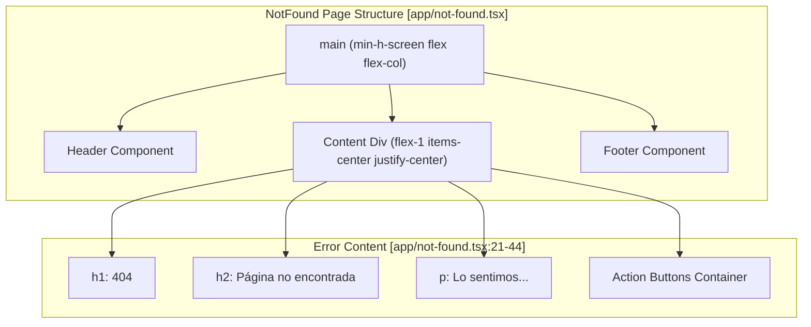
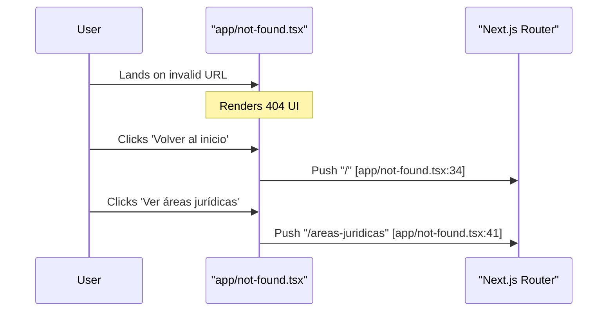

# 404 Not Found Page

This page documents the custom 404 error implementation in the LegalOrbis application. The custom 404 handler is designed to maintain brand consistency, prevent search engine indexing of broken links, and provide clear recovery paths for users who encounter non-existent routes.

## Implementation Overview

The 404 page is implemented as a special Next.js file `app/not-found.tsx`. This component is automatically rendered by the Next.js App Router when a route does not match any defined pages or when the `notFound()` function is programmatically invoked from within a page or layout.

### Metadata and SEO
To protect the site's SEO health, the page explicitly instructs crawlers not to index the error page or follow links from it.

| Property | Value | Source |
| :--- | :--- | :--- |
| **Title** | Página no encontrada \| Legal Orbis Abogados | [app/not-found.tsx:8-8]() |
| **Description** | La página que buscas no existe. | [app/not-found.tsx:9-9]() |
| **Robots Index** | `false` | [app/not-found.tsx:11-11]() |
| **Robots Follow** | `false` | [app/not-found.tsx:12-12]() |

Sources: [app/not-found.tsx:1-14]()

## Component Structure

The `NotFound` component is a functional React component that utilizes the standard site layout elements (`Header` and `Footer`) to ensure the user does not feel "lost" or disconnected from the main application context.

### Visual Composition
The page uses a full-height flex container to center the error message vertically between the header and footer.

**Page Layout Diagram**

Sources: [app/not-found.tsx:16-49]()

### Brand Styling
The content area features a specific brand gradient and typography:
*   **Background**: A linear gradient from `--primary-dark` (`#1A3635`) to a near-black (`#0B0B0B`) [app/not-found.tsx:20-20]().
*   **Typography**: High-contrast white text for headings (`text-white`) and light gray for descriptions (`text-gray-300`) [app/not-found.tsx:22-26]().

## Recovery Navigation

The 404 page provides two primary recovery paths to guide users back to valid content. Both paths utilize the custom `Button` primitive with the `asChild` pattern to wrap Next.js `Link` components.

### Navigation Links

| Target Route | Button Variant | Label | Implementation |
| :--- | :--- | :--- | :--- |
| `/` | Primary (`bg-[#1a5f5f]`) | Volver al inicio | [app/not-found.tsx:30-35]() |
| `/areas-juridicas` | Outline (`border-white`) | Ver áreas jurídicas | [app/not-found.tsx:36-42]() |

**Data Flow: Navigation Recovery**

Sources: [app/not-found.tsx:29-43]()

## Technical Dependencies

The 404 page integrates several core components and utilities to maintain consistency with the rest of the application:

*   **Header**: [app/not-found.tsx:3]() - Provides the global navigation bar.
*   **Footer**: [app/not-found.tsx:4]() - Provides office information and contact links.
*   **Button (UI Primitive)**: [app/not-found.tsx:5]() - The shared button component used for the recovery links.
*   **Metadata (Next.js)**: [app/not-found.tsx:1]() - Type definition for the SEO configuration object.

Sources: [app/not-found.tsx:1-5]()

---
