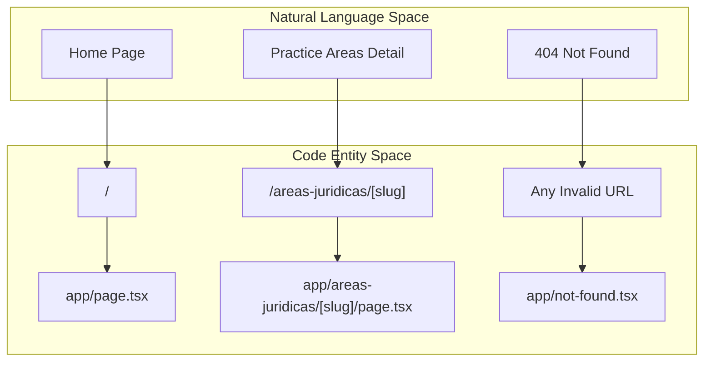
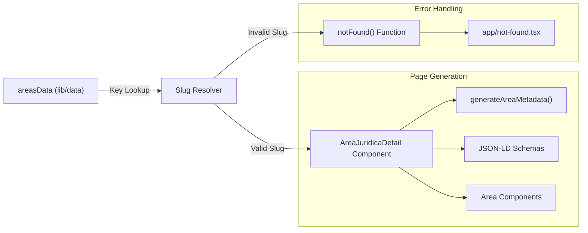

# Application Pages & Routing

This section provides an overview of the **LegalOrbis** page hierarchy and routing architecture. The application utilizes the **Next.js App Router**, leveraging file-based routing to define the site structure. The routing strategy focuses on SEO-optimized dynamic paths for legal practice areas and a performant, component-driven home page.

## Route Architecture

The application is structured into three primary route groups: the main landing page, dynamic legal area details, and error handling.

### Visual Route Hierarchy

The following diagram maps the logical application structure to the physical file system.

**Route-to-File Mapping**

**Sources:** [app/page.tsx:1-57](), [app/areas-juridicas/[slug]/page.tsx:1-127](), [app/not-found.tsx:1-50]()

---

## 2.1 Home Page

The Home Page acts as the central hub of the application. It is designed for high performance using **Next.js Dynamic Imports** to load heavy sections (like video and complex sliders) only when needed, reducing the initial bundle size.

*   **Composition**: The page is a vertical stack of specialized sections including `HeroCarousel`, `QuienesSomos`, `VideoBanner`, and `AreasJuridicas`.
*   **Performance**: Dynamic imports include loading skeletons (e.g., a black background for the `VideoBanner`) to maintain layout stability during hydration.
*   **SEO**: Metadata is generated via `generatePageMetadata` to target broad keywords like "abogados Madrid".

For details, see [Home Page](#2.1).

**Sources:** [app/page.tsx:7-24](), [app/page.tsx:26-42](), [app/page.tsx:47-54]()

---

## 2.2 Legal Area Detail Pages

The application uses dynamic routing to generate specific landing pages for different legal specialties (Penal, Civil, Laboral, etc.). These routes are defined under `app/areas-juridicas/[slug]`.

*   **Slug Resolution**: The `slug` parameter is matched against the `areasData` object keys. If a match is not found, the `notFound()` function is invoked to trigger the 404 handler.
*   **SEO & Schema**: Each page dynamically generates its own metadata and injects three types of JSON-LD structured data: `LegalService`, `BreadcrumbList`, and `FAQPage`.
*   **Data Flow**: Component props are populated directly from the `areasData` object, ensuring UI consistency across different legal branches.

For details, see [Legal Area Detail Pages](#2.2).

**Sources:** [app/areas-juridicas/[slug]/page.tsx:24-36](), [app/areas-juridicas/[slug]/page.tsx:52-58](), [app/areas-juridicas/[slug]/page.tsx:61-80](), [app/areas-juridicas/[slug]/page.tsx:105-122]()

---

## 2.3 404 Not Found Page

The custom `not-found.tsx` handler provides a branded experience for broken links or invalid slugs.

*   **Recovery UX**: It provides explicit navigation buttons to return to the home page or browse the legal areas grid.
*   **SEO Safety**: The page is explicitly marked with `robots: { index: false, follow: false }` to prevent search engines from indexing error states.
*   **Visual Consistency**: It utilizes the brand's primary teal (`#1a5f5f`) and dark gradients to match the overall aesthetic.

For details, see [404 Not Found Page](#2.3).

**Sources:** [app/not-found.tsx:7-14](), [app/not-found.tsx:20-22](), [app/not-found.tsx:30-43]()

---

## Page Navigation & Data Flow

The following diagram illustrates how data from the centralized `areasData` store flows into the dynamic routing system to render the practice area pages.

**Data Flow Diagram**

**Sources:** [app/areas-juridicas/[slug]/page.tsx:24-45](), [app/areas-juridicas/[slug]/page.tsx:52-58](), [app/areas-juridicas/[slug]/page.tsx:61-80]()

---
