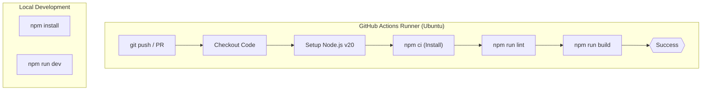
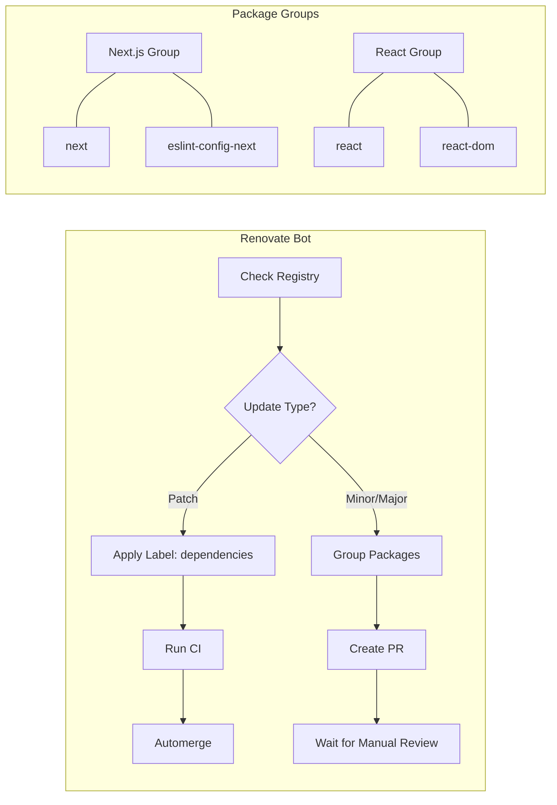

# CI/CD & Dependency Management
This section documents the automation infrastructure of the LegalOrbis project, covering continuous integration, automated dependency maintenance, and the browser compatibility policy.

## Continuous Integration (CI)

The project utilizes GitHub Actions to ensure code quality and build stability. The workflow is defined in `.github/workflows/ci.yml` and triggers on every push or pull request targeting the `main` or `dev` branches [[.github/workflows/ci.yml:3-7]()] [[CLAUDE.md:33-34]()].

### Workflow: `lint-and-build`

The CI pipeline runs on an `ubuntu-latest` environment and executes a sequence of steps to validate the codebase before deployment to Vercel [[.github/workflows/ci.yml:10-11]()].

1.  **Environment Setup**: Uses `actions/checkout@v4` to pull the code and `actions/setup-node@v4` to initialize Node.js version 20 [[.github/workflows/ci.yml:14-20]()]. It leverages the built-in npm caching to speed up subsequent runs [[.github/workflows/ci.yml:21-21]()].
2.  **Dependency Installation**: Executes `npm ci` for a clean, reproducible installation based on the lockfile [[.github/workflows/ci.yml:24-24]()].
3.  **Static Analysis**: Runs `npm run lint` to execute ESLint checks [[.github/workflows/ci.yml:27-27]()].
4.  **Production Build**: Runs `npm run build` to verify that the Next.js application compiles correctly and that TypeScript types are valid [[.github/workflows/ci.yml:30-30]()].

### CI Workflow Logic
The following diagram illustrates the flow from code commit to successful validation.

**CI Pipeline Architecture**

**Sources:**
- `[.github/workflows/ci.yml:1-31]()`
- `[CLAUDE.md:11-19]()`

---

## Dependency Management with Renovate

LegalOrbis uses Renovate bot to automate the process of keeping dependencies up to date. The configuration is stored in `renovate.json` and is tailored to reduce manual maintenance overhead while ensuring stability.

### Configuration Strategy

*   **Schedule**: Updates are restricted to Monday mornings before 9:00 AM (Europe/Madrid timezone) to minimize noise during the work week [[renovate.json:4-5]()].
*   **Automerge**: The bot is configured to automatically merge `patch` updates, assuming they contain non-breaking bug fixes [[renovate.json:9-11]()]. `minor` and `major` updates require manual review and approval [[renovate.json:13-15]()].
*   **Grouping**: Related packages are grouped into single Pull Requests to reduce the number of notifications:
    *   **Next.js Group**: Combines `next` and `eslint-config-next` [[renovate.json:17-19]()].
    *   **React Group**: Combines `react`, `react-dom`, and their corresponding TypeScript types [[renovate.json:21-23]()].

### Dependency Logic Mapping

**Dependency Update Flow**

**Sources:**
- `[renovate.json:1-25]()`

---

## Browser Support Policy

The project maintains a modern browser support policy defined in `.browserslistrc`. This configuration informs tools like Tailwind CSS and the Next.js compiler (via SWC) about the target JavaScript and CSS features [[.browserslistrc:1-8]()].

### Target Environment

The policy targets modern browsers and explicitly excludes legacy environments to keep the bundle size small and avoid unnecessary polyfills:
*   **Coverage**: Browsers with >0.5% global usage [[.browserslistrc:2-2]()].
*   **Recency**: The last 2 versions of major browsers [[.browserslistrc:3-3]()].
*   **Exclusions**: Explicitly excludes Internet Explorer 11 and Opera Mini [[.browserslistrc:5-6]()].

### Impact on Styling
The CSS implementation relies on modern features such as CSS Custom Properties (variables) and Tailwind 4. Components like `AreaDetailHero` use modern CSS properties like `text-shadow` and `backdrop-filter` (via `blur-3xl`) which are supported by the targeted browser set [[components/area-detail-hero.tsx:55,62,78-79]()].

**Sources:**
- `[.browserslistrc:1-8]()`
- `[components/area-detail-hero.tsx:52-81]()`
