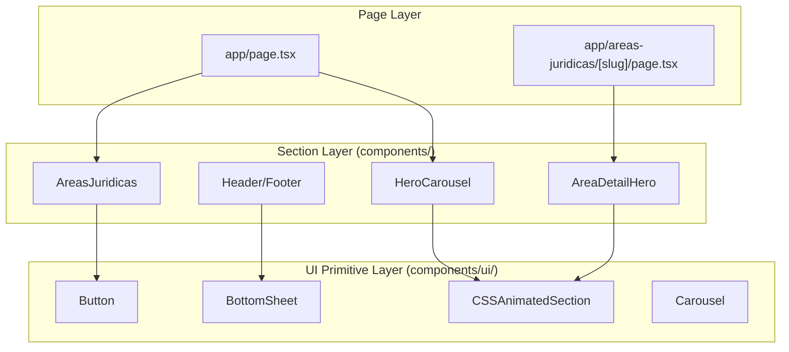
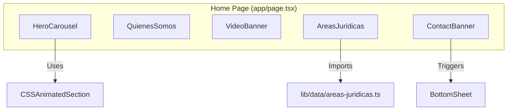

# Component Library

The LegalOrbis component library is organized into a two-layer architecture designed for modularity and performance. The top layer consists of page-level section components that manage specific business logic and layout, while the bottom layer contains reusable UI primitives built on top of Radix UI and Tailwind CSS.

### Component Architecture Overview

The system distinguishes between complex, domain-specific components located in `components/` and generic, atomic UI elements located in `components/ui/`.

**Component Layering Model**

Sources: [components/header.tsx:7-9](), [components/areas-juridicas.tsx:7-9](), [components/ui/bottom-sheet.tsx:3-6]()

---

### Layout & Navigation Components
The `Header` and `Footer` components provide the global structural frame for the application. The `Header` is a sophisticated "scroll-aware" component that tracks the user's position to highlight active sections on the home page and adjusts its visual style (transparency vs. solid background) based on scroll depth. It also serves as the primary trigger for the contact modal, which utilizes a responsive `BottomSheet` pattern.

For details, see [Layout & Navigation Components](#3.1).

Sources: [components/header.tsx:12-47](), [components/header.tsx:141-160](), [components/footer.tsx:35-95]()

---

### Home Page Section Components
The home page is composed of several large-scale sections designed for high visual impact and engagement. Key components include the `HeroCarousel`, which features an auto-advancing image slider, and the `AreasJuridicas` component, which dynamically renders a grid of practice area cards based on the centralized data model.

For details, see [Home Page Section Components](#3.2).

**Home Page Composition**

Sources: [components/hero-carousel.tsx:12-37](), [components/areas-juridicas.tsx:15-102](), [components/contact-banner.tsx:14-89]()

---

### Legal Area Detail Components
These components are specialized for the dynamic `[slug]` routes. They consume props derived from the `areasData` object to render practice-specific content, including hero sections, service branches, and FAQs. They are optimized for SEO and content readability.

For details, see [Legal Area Detail Components](#3.3).

Sources: [components/areas-juridicas.tsx:21-23]()

---

### Contact Form Components
The application features two primary contact form implementations: a full-page version and a reusable version (`ContactFormReusable`) designed for use within modals and bottom sheets. Both share a common validation schema and integrate with Formspree for submission handling.

For details, see [Contact Form Components](#3.4).

Sources: [components/contact-banner.tsx:7-10](), [components/header.tsx:9-15]()

---

### UI Primitives
Located in `components/ui/`, these are the building blocks of the entire interface. They are designed to be accessible and performant, utilizing `IntersectionObserver` for animations and Radix UI for complex interactions like dialogs and accordions.

For details, see [UI Primitives](#3.5).

**UI Component Mapping**
| UI Component | Code Entity | Primary Responsibility |
| :--- | :--- | :--- |
| **Animation Wrapper** | `CSSAnimatedSection` | Intersection-based CSS transitions |
| **Responsive Modal** | `BottomSheet` | Dialog on desktop, drawer on mobile |
| **Value Display** | `ValorDialog` | Interactive display for firm values |
| **Action Element** | `Button` | Styled buttons using CVA variants |

Sources: [components/ui/css-animated-section.tsx:12-56](), [components/ui/bottom-sheet.tsx:100-175](), [components/ui/valor-dialog.tsx:17-50]()

---
