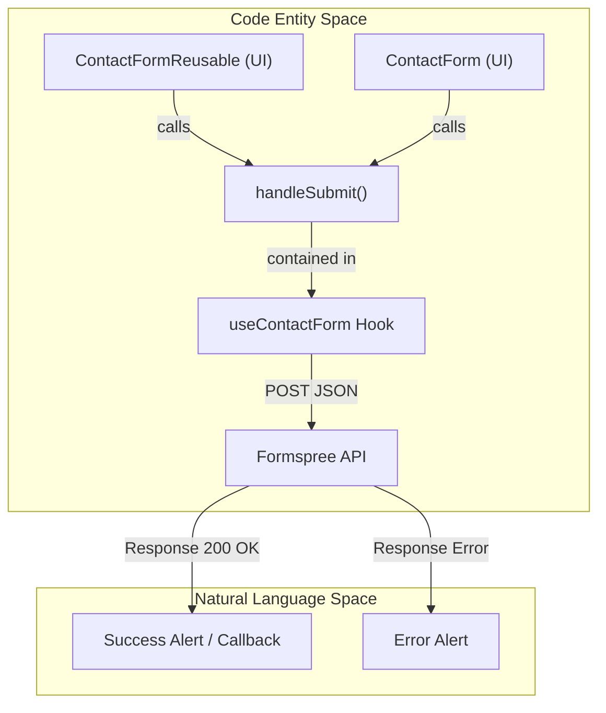
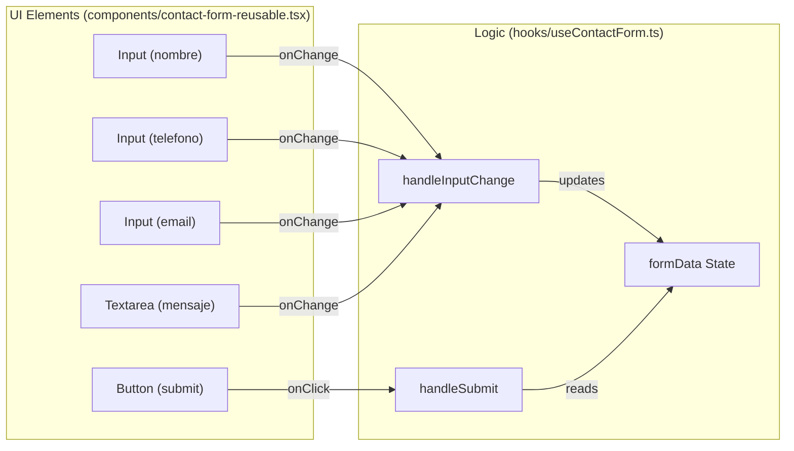

# Contact Form Components

This page documents the contact form implementations within the LegalOrbis codebase. The system provides two primary interfaces for user inquiries: a comprehensive full-page section and a flexible, reusable component designed for modal integration. Both implementations utilize a custom React hook to manage state and interface with the Formspree API.

## Core Logic: useContactForm Hook

The `useContactForm` hook centralizes the state management and submission logic for all contact forms. It abstracts the complexities of handling input changes, managing submission states (loading, success, error), and communicating with the backend service.

### Implementation Details
- **Data Schema**: Defined by the `ContactFormData` interface, capturing `nombre`, `telefono`, `email`, `asunto`, and `mensaje` [hooks/useContactForm.ts:3-9]().
- **State Management**: Uses `useState` to track form values and a boolean `isSubmitting` to prevent duplicate submissions [hooks/useContactForm.ts:30-31]().
- **Integration**: Sends a `POST` request to the Formspree endpoint `https://formspree.io/f/manlbdwz` with a JSON payload [hooks/useContactForm.ts:55-61]().

### Data Flow Diagram
This diagram illustrates how the `useContactForm` hook mediates between the UI components and the external Formspree API.

Title: Contact Form Submission Data Flow

Sources: [hooks/useContactForm.ts:29-91](), [components/contact-form-reusable.tsx:23-24]()

---

## ContactForm (Full Page)

The `ContactForm` component in `components/contact-form.tsx` is a full-width section typically used on the home page. It includes brand-specific contact information (phone, email, address) alongside the input fields [components/contact-form.tsx:82-133]().

### Key Features
- **Contact Info Grid**: Displays office details using `lucide-react` icons like `Phone`, `Mail`, `MapPin`, and `Clock` [components/contact-form.tsx:54-79]().
- **Interactive Map Placeholder**: Includes a UI block for an interactive map [components/contact-form.tsx:124-132]().
- **Local State**: Unlike the reusable version, this implementation currently maintains its own internal state and a simulated 2-second delay for submission [components/contact-form.tsx:7-17](), [components/contact-form.tsx:37]().

Sources: [components/contact-form.tsx:1-153]()

---

## ContactFormReusable

The `ContactFormReusable` component is a streamlined version of the form designed for flexibility. It is primarily used within the `Header` contact modal (via `BottomSheet` or `Dialog`).

### Configuration Props
The component accepts several props to modify its appearance and behavior:
| Prop | Type | Description |
| :--- | :--- | :--- |
| `onSuccess` | `() => void` | Callback executed after successful Formspree submission (e.g., to close a modal). |
| `showTitle` | `boolean` | Controls visibility of the header text (default: `true`). |
| `title` | `string` | Custom heading text. |
| `className` | `string` | Additional CSS classes for the container. |

### Component Architecture
This diagram maps the UI elements to the underlying state management in `useContactForm`.

Title: ContactFormReusable Component Structure

Sources: [components/contact-form-reusable.tsx:8-22](), [components/contact-form-reusable.tsx:37-137](), [hooks/useContactForm.ts:33-41]()

---

## Form Field Schema

The following table details the fields required by the `ContactFormData` interface and their corresponding HTML attributes in the components.

| Field Name | Type | Required | UI Component | File Reference |
| :--- | :--- | :--- | :--- | :--- |
| `nombre` | `string` | Yes | `Input` (text) | [hooks/useContactForm.ts:4]() |
| `telefono` | `string` | Yes | `Input` (tel) | [hooks/useContactForm.ts:5]() |
| `email` | `string` | Yes | `Input` (email) | [hooks/useContactForm.ts:6]() |
| `asunto` | `string` | No | `Input` (text) | [hooks/useContactForm.ts:7]() |
| `mensaje` | `string` | No | `Textarea` | [hooks/useContactForm.ts:8]() |

Sources: [hooks/useContactForm.ts:3-9](), [components/contact-form-reusable.tsx:38-125]()

---
