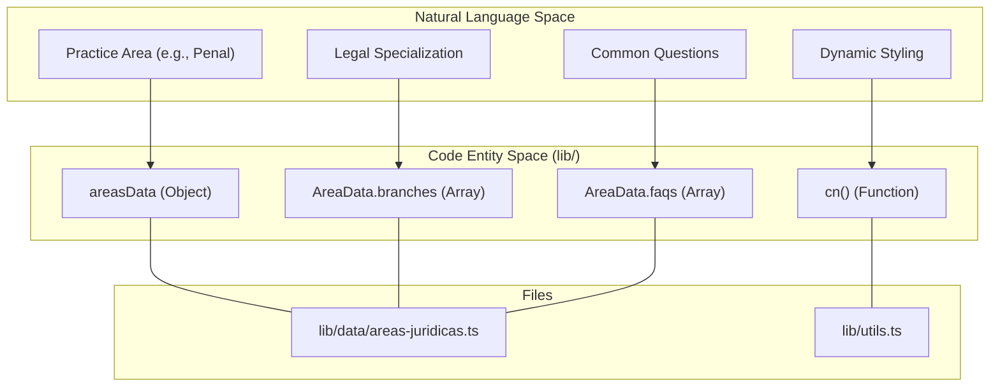
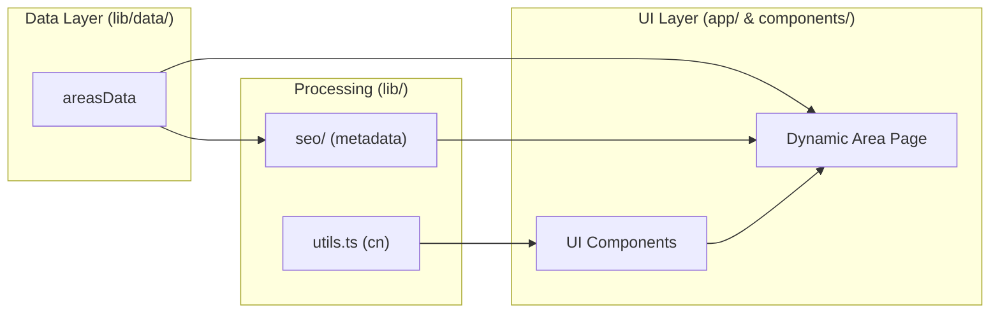

# Data & Content Layer
The **Data & Content Layer** serves as the central repository for the application's domain knowledge and functional logic. It manages the structured data representing the firm's legal expertise and provides the core utility functions used to maintain styling consistency across the React component tree.

By decoupling the legal content from the UI components, the system ensures that updates to practice areas, FAQs, or SEO keywords can be managed in a single location without modifying page structures.

## Core Architecture

The layer is organized into two primary concerns within the `lib/` directory:

1.  **Domain Data**: Static definitions of legal services, branching logic, and practice area metadata.
2.  **Shared Utilities**: Helper functions for DOM manipulation, class merging, and path resolution.

### System Mapping: Natural Language to Code Entities

The following diagram illustrates how conceptual legal entities are mapped to specific TypeScript structures and utility functions within the codebase.

**Content & Utility Mapping**

**Sources:** [lib/data/areas-juridicas.ts:1-200](), [lib/utils.ts:1-7]()

---

## Legal Areas Data Model

The application's content is driven by a centralized data model located in `lib/data/areas-juridicas.ts`. This file defines the five core practice areas: **Penal, Civil, Laboral, Mercantil, and Administrativo**.

Each area is represented by a structured object that contains:
*   **Identification**: Unique IDs and slugs used for dynamic routing.
*   **Marketing Copy**: Subtitles, descriptions, and long-form content for detail pages.
*   **Service Hierarchy**: Specific branches of law and bulleted service lists.
*   **SEO Metadata**: Localized meta titles, descriptions, and keyword arrays used by the SEO subsystem.
*   **FAQ Sets**: Question-and-answer pairs specific to that legal domain.

For a detailed breakdown of the TypeScript interfaces and the full data structure, see [Legal Areas Data Model](#4.1).

**Sources:** [lib/data/areas-juridicas.ts:2-44]()

---

## Utility Functions

The `lib/utils.ts` file provides the foundational logic for the application's presentation layer. Its primary export is the `cn()` function, which facilitates conditional styling and Tailwind CSS class merging.

### The `cn()` Helper
The `cn()` function wraps `clsx` and `tailwind-merge` to solve two common issues in React development:
1.  **Conditional Logic**: Easily toggling classes based on component state.
2.  **Tailwind Conflicts**: Ensuring that classes passed via props correctly override default classes without specificity issues.

### Path Aliasing
The project utilizes a TypeScript path alias `@/*` (configured in `tsconfig.json`) which points to the root directory. This allows for clean, non-relative imports across the `lib/`, `components/`, and `app/` directories.

For technical details on implementation and usage patterns, see [Utility Functions](#4.2).

**Sources:** [lib/utils.ts:1-7]()

---

## Data Flow Diagram

The following diagram shows how data from the `lib/` directory flows into the UI and SEO layers.

**Data Flow Architecture**

**Sources:** [lib/data/areas-juridicas.ts:1-10](), [lib/utils.ts:1-7]()
