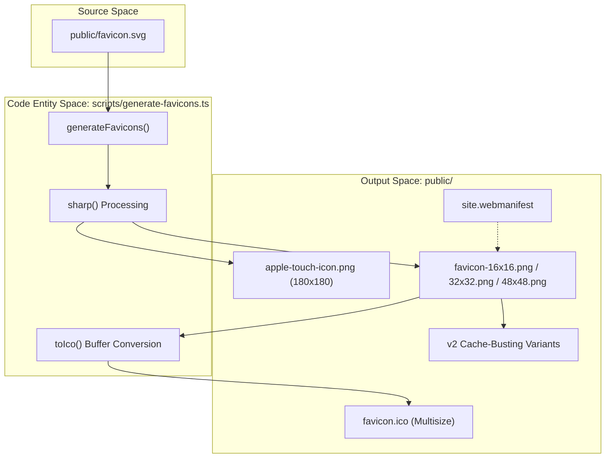
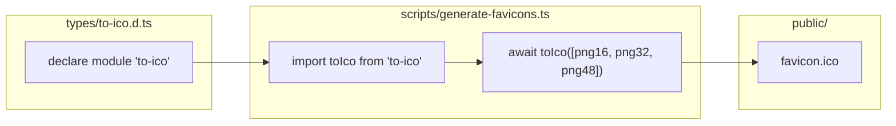

# Favicon & Asset Generation
This page documents the automated asset pipeline used to generate the full suite of favicons and web application icons for LegalOrbis. The system transforms a single source SVG into multiple optimized formats (PNG, ICO) and handles cache-busting variants required for modern SEO and browser compatibility.

## Overview

The asset generation process is centered around a TypeScript script located in `scripts/generate-favicons.ts`. This script utilizes the `Sharp` library for high-performance image processing and `to-ico` for creating multi-resolution Windows icon files.

### Key Components
*   **Source File**: `public/favicon.svg` [public/favicon.svg:1-2]()
*   **Pipeline Script**: `scripts/generate-favicons.ts` [scripts/generate-favicons.ts:1-133]()
*   **Type Definitions**: `types/to-ico.d.ts` [types/to-ico.d.ts:1-10]()
*   **Output Manifest**: `public/site.webmanifest` [public/site.webmanifest:1-29]()

## Implementation Detail

### The Generation Pipeline
The function `generateFavicons()` in `scripts/generate-favicons.ts` executes a sequential workflow to populate the `public/` directory.

1.  **Validation**: Ensures the source `favicon.svg` exists [scripts/generate-favicons.ts:12-14]().
2.  **PNG Generation**: Resizes the SVG into standard dimensions (16, 32, 48, 96, 180, 192, 512) using `sharp` [scripts/generate-favicons.ts:19-54]().
3.  **ICO Compilation**: Combines 16px, 32px, and 48px PNG buffers into a single multi-layer `favicon.ico` using the `to-ico` library [scripts/generate-favicons.ts:56-65]().
4.  **Cache-Busting Variants**: Generates duplicate files with a `-v2` suffix (e.g., `favicon-v2.ico`) to allow for immediate cache invalidation during branding updates [scripts/generate-favicons.ts:74-121]().

### Data Flow Diagram
The following diagram illustrates the transformation from the source SVG to the final distributed assets.

**Asset Transformation Workflow**

Sources: [scripts/generate-favicons.ts:9-132](), [public/site.webmanifest:5-23]()

## Technical Specifications

### Asset Dimensions and Roles
The pipeline generates specific sizes tailored for different platforms:

| File | Size | Purpose |
| :--- | :--- | :--- |
| `favicon-16x16.png` | 16x16 | Legacy browser tabs |
| `favicon-32x32.png` | 32x32 | Standard browser tabs |
| `favicon-48x48.png` | 48x48 | Google Search results (minimum) |
| `favicon-96x96.png` | 96x96 | Google Search results (preferred) |
| `apple-touch-icon.png` | 180x180 | iOS Home Screen |
| `favicon.ico` | 16, 32, 48 | Legacy Windows compatibility |
| `web-app-manifest-192.png` | 192x192 | PWA / Android |

Sources: [scripts/generate-favicons.ts:18-54](), [public/site.webmanifest:5-22]()

### Type Safety
Because the `to-ico` package lacks official TypeScript definitions, a custom declaration is maintained in `types/to-ico.d.ts`. This defines the `toIco` function signature, accepting an array of Buffers and optional size configurations [types/to-ico.d.ts:1-10]().

**Type-Asset Relationship**

Sources: [types/to-ico.d.ts:1-10](), [scripts/generate-favicons.ts:4](), [scripts/generate-favicons.ts:58]()

## Web Manifest Configuration

The `public/site.webmanifest` file maps these generated assets for Progressive Web App (PWA) support. It specifies:
*   **Branding**: Name ("Legal Orbis Abogados") and theme colors (#1A3635) [public/site.webmanifest:2-24]().
*   **Icons**: References to the 192x192 and 512x512 PNGs, marked as "maskable" for Android UI consistency [public/site.webmanifest:5-17]().
*   **Display**: Set to "standalone" to provide a native-like experience when installed [public/site.webmanifest:26]().

Sources: [public/site.webmanifest:1-29]()
