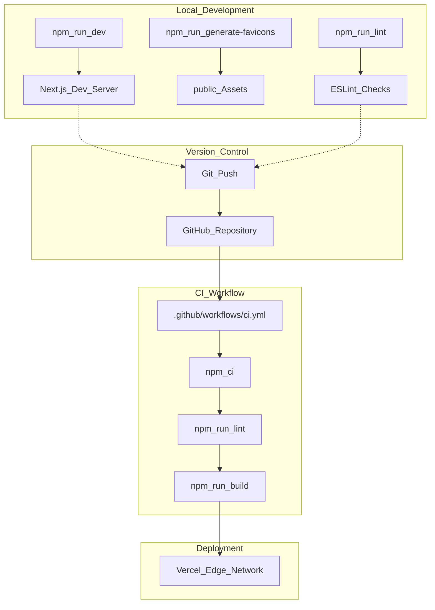

# Getting Started
This page provides the necessary information for developers to set up their local environment, install dependencies, and understand the core development workflow for the LegalOrbis project.

## Overview
LegalOrbis is a corporate web application built with **Next.js 16** and **React 19** [CLAUDE.md:9-9](). It serves as the digital presence for a legal firm, utilizing a modern stack that includes **Tailwind CSS 4**, **Framer Motion** for animations, and **Radix UI** primitives [package.json:13-26]().

## Prerequisites

To contribute to this project, ensure your environment meets the following requirements:

*   **Node.js**: Version 20 or higher is required [package-lock.json:47-47](), [.github/workflows/ci.yml:20-20]().
*   **Package Manager**: `npm` (version included with Node 20).
*   **Operating System**: Cross-platform (Linux/macOS/Windows).

## Installation

Follow these steps to initialize the project locally:

1.  **Clone the repository**:
    ```bash
    git clone https://github.com/gestionDP/LegalOrbis.git
    cd LegalOrbis
    ```

2.  **Install dependencies**:
    The project uses a standard `package-lock.json` to ensure deterministic builds.
    ```bash
    npm install
    ```
    Sources: [CLAUDE.md:14-14](), [package-lock.json:1-6]()

## Environment Setup

The application uses TypeScript path aliasing to simplify imports. The `@/*` alias points to the root directory, allowing for clean imports across the `app/`, `components/`, and `lib/` folders [tsconfig.json:25-29]().

### TypeScript Configuration
The project targets `ES2017` and uses the `bundler` module resolution strategy [tsconfig.json:3-15](). It includes specific type definitions for third-party libraries like `to-ico` [types/to-ico.d.ts:1-10]().

## Available Scripts

The following scripts are defined in `package.json` to manage the development lifecycle:

| Script | Command | Description |
| :--- | :--- | :--- |
| `dev` | `next dev` | Starts the Next.js development server. |
| `dev:turbo` | `next dev --turbopack` | Starts the development server using the Turbopack engine for faster HMR. |
| `build` | `next build` | Compiles the application for production. |
| `start` | `next start` | Starts the production server (requires `npm run build`). |
| `lint` | `eslint` | Runs ESLint to check for code quality and style issues. |
| `generate-favicons` | `tsx scripts/generate-favicons.ts` | Executes the favicon generation pipeline using Sharp and to-ico. |

Sources: [package.json:5-12](), [CLAUDE.md:11-19]()

### Local Development Workflow

The following diagram illustrates the relationship between the local development environment and the automated CI/CD pipeline.

**Development to Deployment Flow**

Sources: [package.json:5-12](), [.github/workflows/ci.yml:1-31](), [CLAUDE.md:31-35]()

## Asset Generation

A specialized script is used to maintain brand assets. The `generate-favicons` script processes a source SVG to create a full suite of icons required for various browsers and devices.

*   **Input**: `public/favicon.svg` (assumed source).
*   **Processing**: Uses `sharp` for image manipulation and `to-ico` for `.ico` packaging [package.json:35-37]().
*   **Output**: Generates multiple sizes including 16x16, 32x32, 48x48, 96x96, and 180x180 [types/to-ico.d.ts:2-7]().

## Automated Maintenance

The repository uses **Renovate Bot** to keep dependencies up to date.
*   **Schedule**: Runs every Monday before 9 AM (Europe/Madrid) [renovate.json:4-5]().
*   **Automerge**: Patch updates are automatically merged if they pass CI [renovate.json:9-11]().
*   **Groupings**: `Next.js` and `React` updates are grouped to ensure compatibility [renovate.json:17-24]().

**Dependency Relationship Mapping**
```mermaid
graph LR
    subgraph "Core_Framework"
        "next"["next@16.1.1"]
        "react"["react@19.1.0"]
        "react-dom"["react-dom@19.1.0"]
    end

    subgraph "UI_Styling"
        "tailwindcss"["tailwindcss@4"]
        "framer-motion"["framer-motion@12.23.24"]
        "lucide-react"["lucide-react@0.546.0"]
    end

    subgraph "Radix_Primitives"
        "radix-accordion"["@radix-ui/react-accordion"]
        "radix-dialog"["@radix-ui/react-dialog"]
    end

    "next" --> "react"
    "next" --> "react-dom"
    "UI_Styling" -.-> "next"
    "Radix_Primitives" -.-> "react"
```
Sources: [package.json:13-26](), [package.json:36-36](), [renovate.json:17-24]()
