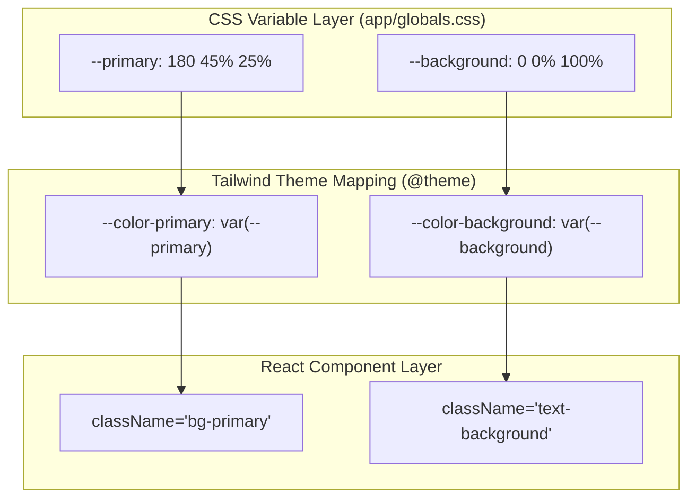
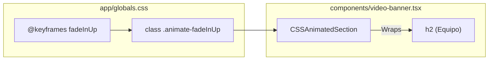

# Global Styles & CSS Variables
This section documents the foundational styling architecture of LegalOrbis, centered around `app/globals.css`. The project utilizes Tailwind CSS 4 and CSS custom properties (variables) to maintain a consistent brand identity across light and dark modes.

## CSS Custom Properties (Design Tokens)

The application uses CSS variables to define its design tokens, which are then mapped to Tailwind utility classes. This approach allows for dynamic theme switching and centralized management of brand colors.

### Root Tokens (Light Mode)
The default theme is based on a "Legal Orbis Teal" palette.

| Variable | Value | Description |
| :--- | :--- | :--- |
| `--primary` | `180 45% 25%` | Primary brand teal used for buttons and highlights [app/globals.css:54](). |
| `--background` | `0 0% 100%` | Main application background (White) [app/globals.css:48](). |
| `--foreground` | `0 0% 15%` | Primary text color (Dark Grey/Black) [app/globals.css:49](). |
| `--accent` | `180 45% 25%` | Same as primary, used for interactive elements [app/globals.css:60](). |
| `--radius` | `0.5rem` | Base border radius for components [app/globals.css:47](). |

### Dark Mode Variants
Dark mode is activated via the `.dark` class. It shifts the primary teal to a lighter shade for better contrast against dark backgrounds.

| Variable | Value | Description |
| :--- | :--- | :--- |
| `--background` | `0 0% 15%` | Dark background [app/globals.css:83](). |
| `--primary` | `180 45% 35%` | Lighter teal for accessibility in dark mode [app/globals.css:89](). |
| `--border` | `0 0% 100% / 10%` | Semi-transparent white borders [app/globals.css:99](). |

**Sources:** [app/globals.css:46-115]()

---

## Tailwind Integration & Theme Mapping

LegalOrbis uses the `@theme inline` directive to map CSS variables directly into the Tailwind engine. This ensures that utility classes like `bg-primary` or `text-foreground` stay in sync with the custom properties defined above.

### Design Token Flow
The following diagram illustrates how raw CSS values flow from the `:root` definition into the React component layer.

**Token Resolution Diagram**

**Sources:** [app/globals.css:6-44](), [app/globals.css:46-80]()

---

## Custom Utility Classes

Beyond standard Tailwind utilities, the codebase defines several "Legal Orbis" specific classes under the `@layer components` directive to encapsulate complex or repeated styles.

### Layout & Spacing
*   `.container-max`: Sets a maximum width of `1600px` and centers the content. Used for high-resolution displays [app/globals.css:174-176]().
*   `.section-padding`: Standardizes vertical spacing for page sections (`py-32`) and horizontal gutters [app/globals.css:170-172]().

### UI Elements
*   `.legal-gradient`: A 135-degree linear gradient from teal (`#1a5f5f`) to light blue (`#5eb4d4`) [app/globals.css:142-144]().
*   `.legal-button`: The primary CTA style, applying `--primary` background and transition effects [app/globals.css:162-164]().
*   `.legal-card`: Encapsulates background, rounding, and hover shadow transitions for practice area cards [app/globals.css:158-160]().

### Typography & Effects
*   `.legal-text-gradient`: Applies the brand gradient to text using `-webkit-background-clip: text` [app/globals.css:146-151]().
*   `.line-clamp-4`: A utility for truncating long descriptions to exactly four lines [app/globals.css:179-184]().

**Sources:** [app/globals.css:141-195]()

---

## CSS Animations

The application includes a set of hardware-accelerated CSS animations that do not rely on JavaScript. These are primarily utilized by the `CSSAnimatedSection` component.

### Keyframe Definitions
The following animations are defined with a default duration of `0.6s` and an `ease-out` timing function:
*   `fadeInUp`: Moves element from `translateY(30px)` to `0` [app/globals.css:197-206]().
*   `fadeInLeft`: Moves element from `translateX(-30px)` to `0` [app/globals.css:208-217]().
*   `fadeInRight`: Moves element from `translateX(30px)` to `0` [app/globals.css:219-228]().
*   `fadeInScale`: Scales element from `0.95` to `1` [app/globals.css:230-239]().

### Implementation Example
In `VideoBanner`, these animations are applied to reveal content as the user interacts with the page.

**Animation Application Diagram**

**Sources:** [app/globals.css:197-255](), [components/video-banner.tsx:39-43]()

---

## Global Resets & Base Styles

The `@layer base` section applies global defaults to HTML elements:
*   **Smooth Scrolling**: Enabled via `scroll-behavior: smooth` for anchor navigation [app/globals.css:124-126]().
*   **Font Smoothing**: Antialiasing is forced for better legibility of the Geist font [app/globals.css:134-137]().
*   **Performance**: `will-change-auto` is applied to `img`, `video`, and `iframe` to optimize rendering [app/globals.css:128-132]().

**Sources:** [app/globals.css:117-138]()
