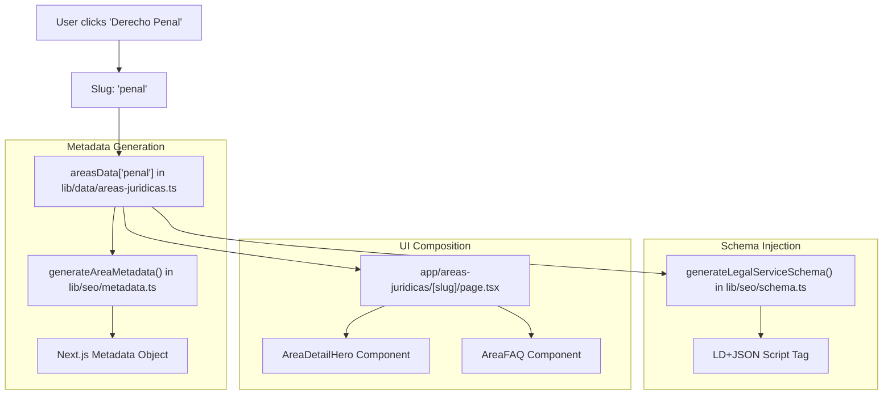
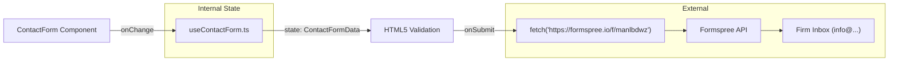

# Glossary

This glossary defines the technical terminology, domain-specific legal concepts, and framework-level jargon used throughout the LegalOrbis codebase. It serves as a reference for onboarding engineers to understand how natural language requirements translate into technical implementation.

## 1. Legal Domain Terminology (Spanish)

These terms represent the business logic and content categories defined in the legal data model.

| Term | Technical Context | Definition |
|:---|:---|:---|
| **Área Jurídica** | `areasData` keys | A primary practice area (e.g., Penal, Civil). Represented by the `AreaData` interface [lib/data/areas-juridicas.ts:2](). |
| **Rama (Branch)** | `area.branches` | Specific sub-specialties within a legal area used for UI lists [lib/data/areas-juridicas.ts:44-50](). |
| **Derecho Penal** | `areasData.penal` | Criminal law. The core specialty of the firm [lib/data/areas-juridicas.ts:3-11](). |
| **Derecho Penitenciario** | `areasData.penal` | Prison law. Included within the Penal area data [lib/data/areas-juridicas.ts:5](). |
| **Investigado** | FAQ content | A person under investigation in a criminal procedure; a key keyword for SEO [lib/data/areas-juridicas.ts:58](). |

**Sources:** [lib/data/areas-juridicas.ts:1-82]()

---

## 2. Codebase Specific Terms

Terms unique to the LegalOrbis architecture and implementation patterns.

### Dynamic Metadata Factory
A pattern used in `lib/seo/metadata.ts` where functions like `generateAreaMetadata` act as factories to create Next.js `Metadata` objects by merging site-wide defaults with area-specific data [lib/seo/metadata.ts:152-181]().

### Schema Injector
The system uses functions in `lib/seo/schema.ts` to generate JSON-LD objects. These are "injected" into the `<head>` of pages to provide structured data to search engines [lib/seo/schema.ts:121-280]().

### Contact Form Reusable
A specific component pattern where the form logic is abstracted into `hooks/useContactForm.ts` to support both the standalone contact page and the Header's modal trigger [hooks/useContactForm.ts:29-91]().

**Sources:** [lib/seo/metadata.ts:152-181](), [lib/seo/schema.ts:1-280](), [hooks/useContactForm.ts:29-91]()

---

## 3. Technical & Framework Jargon

Standard industry terms as they apply specifically to this project's configuration.

### AVIF/WebP Optimization
The image pipeline configured in `next.config.ts` that prioritizes modern, high-compression formats for legal imagery [next.config.ts:4-11]().

### Cache-Busting (v2)
A strategy implemented in `app/robots.ts` and `scripts/generate-favicons.ts` where assets like `favicon-v2.ico` are explicitly allowed and versioned to bypass stale browser caches [app/robots.ts:14-17]().

### Immutable Assets
Assets served with a 1-year `Cache-Control` TTL (31,536,000 seconds) and the `immutable` flag, as configured for the `_next/static` and `/images` directories [next.config.ts:80-96]().

**Sources:** [next.config.ts:4-152](), [app/robots.ts:9-25]()

---

## 4. Architectural Diagrams

### Concept Mapping: Natural Language to Code Entities
The following diagram bridges how a user's request (e.g., "I want to see the Penal Law page") maps to specific code structures.

**Title: Request Resolution Flow**

**Sources:** [lib/data/areas-juridicas.ts:2-79](), [lib/seo/metadata.ts:152-181](), [lib/seo/schema.ts:234-262]()

---

### Data Flow: Form Submission
This diagram traces the path of data from the user interface to the external service provider.

**Title: Contact Form Data Pipeline**

**Sources:** [hooks/useContactForm.ts:3-91](), [components/contact-form.tsx]()

---

## 5. Abbreviations & Keys

| Abbreviation | Full Term | Context |
|:---|:---|:---|
| **CVA** | Class Variance Authority | Used in `components/ui/` for managing Tailwind variants. |
| **JSON-LD** | JSON for Linked Data | The format used in `lib/seo/schema.ts` for SEO. |
| **TTL** | Time To Live | Cache duration configured in `next.config.ts` [next.config.ts:8](). |
| **OG** | Open Graph | Metadata for social sharing (Facebook, LinkedIn) [lib/seo/metadata.ts:52](). |
| **CSP** | Content Security Policy | Security headers for SVG handling [next.config.ts:10](). |

**Sources:** [next.config.ts:1-205](), [lib/seo/metadata.ts:1-181]()
