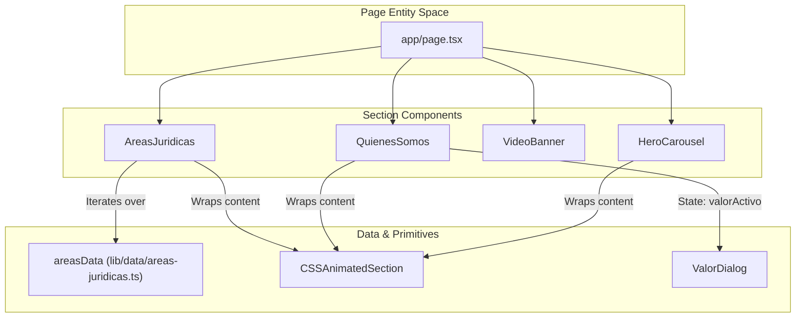
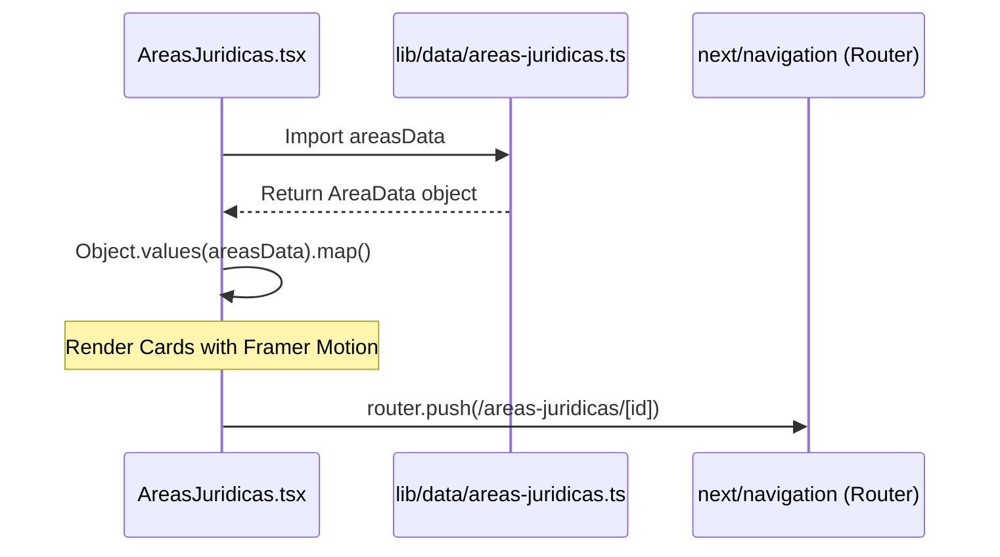

# Home Page Section Components
This page documents the high-level section components that compose the LegalOrbis home page. These components are designed for high visual impact, utilizing a combination of **Tailwind CSS**, **Framer Motion** (via `CSSAnimatedSection`), and **Next.js Image/Video** optimization.

## Overview of Sections

The home page is built as a sequence of full-width sections, most of which utilize the `section-padding` and `container-max` utility classes defined in `app/globals.css` [170-176]().

### Component Hierarchy & Data Flow

The following diagram illustrates how the home page sections relate to the underlying data structures and UI primitives.

**Home Page Component Architecture**

**Sources:** [components/hero-carousel.tsx:8-142](), [components/quienes-somos.tsx:9-144](), [components/areas-juridicas.tsx:11-107](), [lib/data/areas-juridicas.ts:1-200]()

---

## HeroCarousel

The `HeroCarousel` serves as the primary entry point of the site. It is a full-screen (`h-screen`) auto-advancing slider.

### Implementation Details
- **State Management**: Uses `currentSlide` to track the active index [9]().
- **Auto-Advance**: A `useEffect` hook sets an interval of 6000ms to advance the slide [46-51](). It includes a safety check for `isMounted` to prevent hydration mismatches [40-44]().
- **Transitions**: Slides use absolute positioning and toggle `opacity-100` vs `opacity-0` with a `duration-1000` transition [71-73]().
- **Optimization**: The first image in the array uses the `priority` prop for LCP (Largest Contentful Paint) optimization [80]().

**Sources:** [components/hero-carousel.tsx:8-142]()

---

## QuienesSomos (About Us)

This section details the firm's values and multidisciplinary approach. It features an interactive tab-like navigation system for different organizational values.

### Value Navigation Logic
The component maintains a `valorActivo` state [10](). When a user clicks a dot navigation button, the state updates, triggering a content swap of the title, description, and image [75-87]().

| Feature | Implementation |
| :--- | :--- |
| **State** | `valorActivo: number` [10]() |
| **Data Structure** | Array of objects containing `palabra`, `titulo`, `descripcion`, and `imagen` [12-34]() |
| **Statistics Grid** | A four-column grid displaying firm milestones (e.g., 15+ years experience) [108-140]() |

**Sources:** [components/quienes-somos.tsx:9-144]()

---

## AreasJuridicas

This component renders a grid of the firm's practice areas. It dynamically maps over the `areasData` object imported from the library.

### Data Interaction
- **Dynamic Mapping**: It converts the `areasData` object into an array using `Object.values(areasData)` [15]().
- **Navigation**: Uses the Next.js `useRouter` hook to navigate to specific detail pages (e.g., `/areas-juridicas/penal`) when the "CONOCER MÁS" button is clicked [21-23](), [91-96]().
- **Visuals**: Each card features a background image with a dark overlay (`bg-black/60`) to ensure text readability [70]().

**Practice Area Rendering Flow**

**Sources:** [components/areas-juridicas.tsx:11-107](), [lib/data/areas-juridicas.ts:9-10]()

---

## VideoBanner

A high-impact visual section featuring a background video loop.

### Technical Configuration
- **Video Attributes**: The `<video>` element is configured with `autoPlay`, `muted`, `loop`, and `playsInline` for mobile compatibility [10-14]().
- **Performance**: Uses `preload="none"` to save bandwidth until the section is near the viewport [15]().
- **Error Handling**: Includes an `onError` handler that hides the video element if the source fails to load, preventing a broken UI [17-19]().
- **Overlay**: A `bg-black/60` div is layered over the video to maintain a minimum contrast ratio for the white text [24]().

**Sources:** [components/video-banner.tsx:6-61]()

---

## Animation Strategy

All sections utilize `CSSAnimatedSection` to handle entry animations. This component abstracts the intersection observer logic and applies CSS classes defined in `app/globals.css`.

### Available Animations
The following animations are defined in the global CSS layer [197-256]():
- `fadeInUp`: Translates from `30px` to `0` while fading in.
- `fadeInLeft`: Translates from `-30px` to `0`.
- `fadeInRight`: Translates from `30px` to `0`.
- `fadeInScale`: Scales from `0.95` to `1`.

**Sources:** [app/globals.css:197-256](), [components/ui/css-animated-section.tsx:1-50]()
