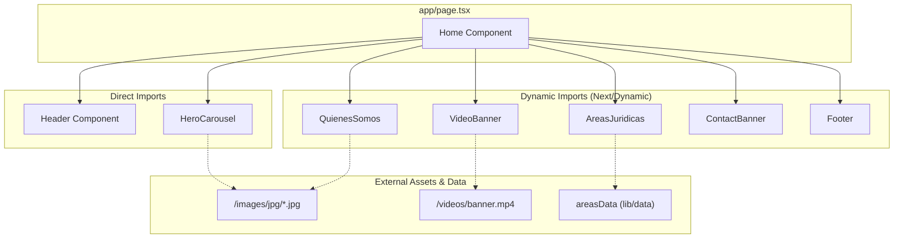
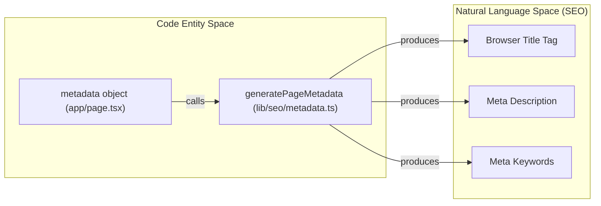

# Home Page

The Home Page serves as the primary entry point for the Legal Orbis application. It is a single-page layout composed of several high-impact sections designed to introduce the firm's values, team, and legal expertise. The implementation leverages Next.js dynamic imports to optimize the initial bundle size and uses specialized animation components for a polished user experience.

## Composition and Structure

The page is defined in `app/page.tsx` and follows a linear vertical composition. It integrates both static and dynamically imported components to balance performance and interactivity.

### Component Layout
The `Home` component in [app/page.tsx:44-56]() renders the following sequence:

1.  **Header**: Persistent navigation and contact triggers.
2.  **HeroCarousel**: Above-the-fold visual impact with auto-advancing slides.
3.  **QuienesSomos**: Detailed section about firm values and team composition.
4.  **VideoBanner**: Immersive video background with brand messaging.
5.  **AreasJuridicas**: Grid of practice areas linking to detail pages.
6.  **ContactBanner**: Call-to-action for lead generation.
7.  **Footer**: Office information and site-wide links.

### Data Flow Diagram
The following diagram illustrates how the Home Page orchestrates its sub-components and where data/assets originate.

**Home Page Component Architecture**

**Sources:** [app/page.tsx:1-57](), [components/hero-carousel.tsx:12-37](), [components/quienes-somos.tsx:12-34]()

---

## Dynamic Loading Strategy

To improve the Core Web Vitals (specifically Largest Contentful Paint and Total Blocking Time), the Home Page utilizes `next/dynamic`. Components below the fold are loaded only when needed, with skeleton-style `loading` states to prevent layout shifts.

| Component | Loading Strategy | Placeholder UI |
| :--- | :--- | :--- |
| `QuienesSomos` | Dynamic | Div with `.section-padding` and `#0B0B0B` background [app/page.tsx:26-28]() |
| `VideoBanner` | Dynamic | Div with `h-screen` and black background [app/page.tsx:30-32]() |
| `AreasJuridicas` | Dynamic | Div with `.section-padding` and `#0B0B0B` background [app/page.tsx:34-36]() |
| `ContactBanner` | Dynamic | Div with `.section-padding` [app/page.tsx:38-40]() |
| `Footer` | Dynamic | Default (null) [app/page.tsx:42]() |

**Sources:** [app/page.tsx:26-42]()

---

## Core Sections Implementation

### HeroCarousel
The `HeroCarousel` [components/hero-carousel.tsx:8-142]() is a client-side component that manages an array of slides.
- **State Management**: Uses `useState` for `currentSlide` and an `isMounted` flag to ensure client-side hydration before starting timers [components/hero-carousel.tsx:9-10]().
- **Auto-advance**: A `setInterval` advances the slide every 6000ms [components/hero-carousel.tsx:46-48]().
- **Animations**: Uses `CSSAnimatedSection` with the `fadeInUp` animation to reveal text content over the background images [components/hero-carousel.tsx:91-101]().

### QuienesSomos (Firm Values)
The `QuienesSomos` component [components/quienes-somos.tsx:9-144]() handles the presentation of firm values (Compromiso, Profesionalidad, Transparencia).
- **Interactive State**: Tracks `valorActivo` to switch between descriptions and images [components/quienes-somos.tsx:10]().
- **Statistics Grid**: Displays a counter-style section with firm metrics (15+ Years, 500+ Cases) using `.border-t border-white/10` for visual separation [components/quienes-somos.tsx:108-140]().

### VideoBanner
The `VideoBanner` [components/video-banner.tsx:6-58]() provides a cinematic break in the content.
- **Video Implementation**: Uses a standard `<video>` tag with `autoPlay`, `muted`, and `loop` [components/video-banner.tsx:10-23]().
- **Fallback**: Includes an `onError` handler that hides the video element if the source fails to load [components/video-banner.tsx:17-19]().

---

## SEO and Metadata

The Home Page defines its SEO properties using the `generatePageMetadata` helper. This ensures the page has optimized tags for search engines and social media.

**Metadata Configuration [app/page.tsx:7-24]():**
- **Title**: "Abogados en Madrid | Legal Orbis - Despacho Jurídico Especializado"
- **Description**: Focuses on "multidisciplinar", "Madrid", and specific branches like "Penal, Civil, Laboral".
- **Keywords**: A curated list including "abogados penalistas Madrid" and "asesoría legal Madrid".
- **Canonical URL**: Set to `/`.

**Code-to-SEO Mapping**

**Sources:** [app/page.tsx:7-24](), [lib/seo/metadata.ts:1-20]()

---

## Styling and Layout Utilities

The page relies on global utility classes defined in `app/globals.css` to maintain consistency across sections.

- **`.section-padding`**: Standardizes vertical spacing (`py-32`) and horizontal gutters [app/globals.css:170-172]().
- **`.container-max`**: Constrains the content width to `1600px` for ultra-wide displays [app/globals.css:174-176]().
- **CSS Animations**: Animations like `fadeInUp` and `fadeInLeft` are defined as CSS keyframes and applied via the `CSSAnimatedSection` component to avoid the overhead of large JS animation libraries for simple entrance effects [app/globals.css:197-256]().

**Sources:** [app/globals.css:170-256](), [components/ui/css-animated-section.tsx:1-10]()

---
