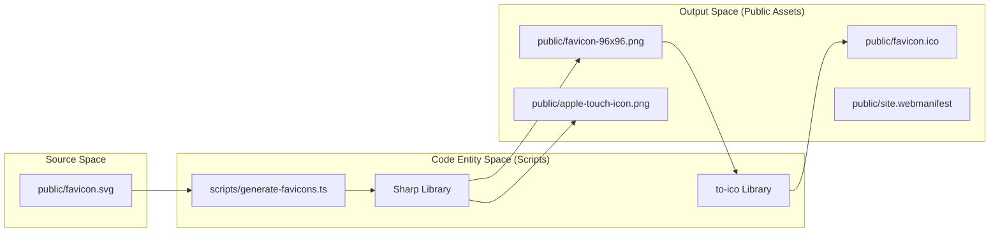

# Infrastructure & Deployment

This section provides an overview of the LegalOrbis infrastructure stack, focusing on the production deployment environment, build-time optimizations, and automated maintenance workflows. The application is designed as a high-performance static site deployed on **Vercel**, utilizing **Next.js** features for asset optimization and security.

### System Architecture Overview

The following diagram illustrates the relationship between the configuration files and the deployment lifecycle:

**Deployment & Configuration Flow**
```mermaid
graph TD
    subgraph "Local Development"
        [scripts/generate-favicons.ts] -->|"Generates"| [public/favicon-*.png]
        [scripts/generate-favicons.ts] -->|"Generates"| [public/favicon.ico]
    end

    subgraph "CI/CD (GitHub Actions)"
        [.github/workflows/ci.yml] -->|"Runs"| [npm_run_lint]
        [.github/workflows/ci.yml] -->|"Runs"| [npm_run_build]
    end

    subgraph "Runtime Environment (Vercel)"
        [next.config.ts] -->|"Configures"| [Next_Server]
        [vercel.json] -->|"Configures"| [Vercel_Edge]
        [Next_Server] -->|"Serves"| [App_Router]
        [Vercel_Edge] -->|"Headers/Redirects"| [Browser]
    end

    [renovate.json] -->|"Updates"| [package.json]
```
**Sources:** [.github/workflows/ci.yml:1-31](), [next.config.ts:3-203](), [vercel.json:1-43](), [CLAUDE.md:13-19]()

---

## 7.1 Next.js Configuration

The `next.config.ts` file serves as the primary engine for application-level behavior. It handles complex image optimization pipelines, security headers, and SEO-critical redirection logic.

Key responsibilities include:
*   **Image Optimization**: Supporting high-efficiency formats like AVIF and WebP [next.config.ts:4-11]().
*   **Performance**: Stripping `console.log` in production and optimizing package imports for heavy libraries like `framer-motion` and `lucide-react` [next.config.ts:19-36]().
*   **Security & Caching**: Implementing strict HTTP headers (X-Frame-Options, CSP for SVGs) and an immutable caching strategy for static assets [next.config.ts:38-152]().
*   **Routing Logic**: Enforcing HTTPS, canonical `www` domains, and sanitizing URLs [next.config.ts:157-202]().

For details, see [Next.js Configuration](#7.1).

**Sources:** [next.config.ts:1-205]()

---

## 7.2 Vercel Deployment Configuration

The `vercel.json` file complements the Next.js configuration by defining Edge-level behaviors. It ensures that the hosting environment respects the application's routing preferences, such as `cleanUrls` and the absence of trailing slashes.

*   **Global Routing**: Configuration for `cleanUrls: true` and `trailingSlash: false` [vercel.json:2-3]().
*   **Edge Headers**: Redundant cache-control enforcement for critical brand assets like the `apple-touch-icon.png` to ensure high availability and performance [vercel.json:5-42]().

For details, see [Vercel Deployment Configuration](#7.2).

**Sources:** [vercel.json:1-43]()

---

## 7.3 Favicon & Asset Generation

LegalOrbis uses a scripted approach to asset management to ensure consistency across different device resolutions and platforms.

**Asset Pipeline Entity Map**


The system relies on `scripts/generate-favicons.ts` to transform a single source SVG into a full suite of icons [CLAUDE.md:18](). This ensures that the `favicon-96x96.png` and other variants are always up to date with the latest brand identity [public/icon-96x96.png:1-26]().

For details, see [Favicon & Asset Generation](#7.3).

**Sources:** [scripts/generate-favicons.ts](), [public/icon-96x96.png:1-26](), [CLAUDE.md:18-18]()

---

## 7.4 CI/CD & Dependency Management

The project maintains a high standard of code health through automated workflows and dependency tracking.

*   **GitHub Actions**: The `ci.yml` workflow automatically triggers on pushes to `main` and `dev` branches, executing `npm run lint` and `npm run build` to prevent regressions [ .github/workflows/ci.yml:3-30]().
*   **Automated Updates**: **Renovate Bot** is configured to manage dependencies, with specific grouping for `Next.js` and `React` packages to ensure compatibility [renovate.json:17-24](). It is set to automerge patch updates every Monday morning [renovate.json:4-11]().
*   **Browser Compatibility**: The project targets modern browsers as defined in `.browserslistrc`, ensuring the CSS features of Tailwind 4 are supported.

For details, see [CI/CD & Dependency Management](#7.4).

**Sources:** [.github/workflows/ci.yml:1-31](), [renovate.json:1-26](), [CLAUDE.md:13-19]()

---
