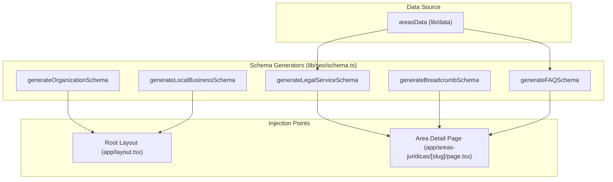
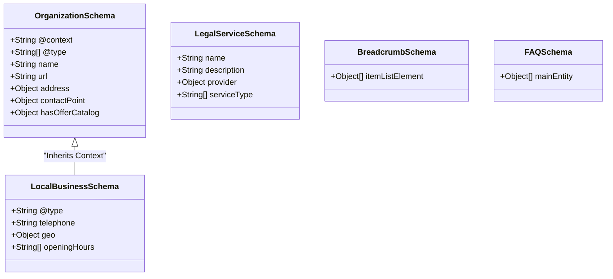

# JSON-LD Structured Data Schemas
This page documents the implementation of structured data schemas within the LegalOrbis codebase. These schemas use the JSON-LD format to provide search engines with explicit information about the firm's organization, physical location, legal services, and site structure, enhancing Search Engine Optimization (SEO) and enabling rich snippets in search results.

## Implementation Overview

The system centralizes schema generation in `lib/seo/schema.ts`. It defines five primary generators that produce objects conforming to [Schema.org](https://schema.org) specifications. These objects are then injected into the HTML `<head>` or `<body>` using `<script type="application/ld+json">` tags.

### Core Architecture

The data flow starts from the page-level components (Root Layout or Dynamic Area Pages), which call the generator functions and serialize the output.

**Data Flow: Schema Generation to Injection**

**Sources:** [lib/seo/schema.ts:1-290](), [app/layout.tsx:32-56](), [app/areas-juridicas/[slug]/page.tsx:60-103]()

---

## Schema Generators

### Global Schemas (Root Layout)

These schemas are injected globally via the `RootLayout` to represent the firm's identity and physical presence.

| Function | Interface | Description |
| :--- | :--- | :--- |
| `generateOrganizationSchema` | `OrganizationSchema` | Defines the firm as a `LegalService`, `Attorney`, and `Organization`. Includes logo, contact points, and a service catalog. |
| `generateLocalBusinessSchema` | `LocalBusinessSchema` | Provides geographic coordinates (lat/long), opening hours, and address for local SEO. |

*   **Organization Schema:** Includes an `OfferCatalog` listing the main practice areas (Penal, Civil, Laboral, etc.) [lib/seo/schema.ts:157-194]().
*   **LocalBusiness Schema:** Specifically targets the Madrid office location with `GeoCoordinates` [lib/seo/schema.ts:216-220]().

**Sources:** [lib/seo/schema.ts:121-231](), [app/layout.tsx:32-33]()

### Contextual Schemas (Dynamic Pages)

These generators are used within `app/areas-juridicas/[slug]/page.tsx` to provide detail-specific metadata.

#### LegalService Schema
Generated via `generateLegalServiceSchema`. It describes a specific legal practice area (e.g., "Derecho Penal").
*   **Provider:** Links back to the main organization [lib/seo/schema.ts:247-251]().
*   **Offers:** Includes a standard "First consultation free" description [lib/seo/schema.ts:257-260]().

#### Breadcrumb Schema
Generated via `generateBreadcrumbSchema`. It maps the navigation path: `Inicio > Áreas Jurídicas > [Area Name]`.
*   **Positioning:** Uses `itemListElement` with incremental positions [lib/seo/schema.ts:273-278]().

#### FAQ Schema
Generated via `generateFAQSchema` only if the specific legal area contains FAQ data.
*   **Structure:** Maps `area.faqs` to `Question` and `Answer` types [lib/seo/schema.ts:283-290]().

**Sources:** [lib/seo/schema.ts:234-290](), [app/areas-juridicas/[slug]/page.tsx:61-80]()

---

## Technical Interfaces

The schemas are backed by TypeScript interfaces to ensure compliance with JSON-LD standards.

**Class Diagram: Schema Type Definitions**

**Sources:** [lib/seo/schema.ts:3-118]()

---

## Injection Mechanism

The application uses Next.js Server Components to inject these schemas. Since they are static JSON objects, they are serialized using `JSON.stringify()` and placed inside a script tag with `dangerouslySetInnerHTML`.

### Global Injection (`app/layout.tsx`)
The `Organization` and `LocalBusiness` schemas are placed in the `<head>` of the root layout to ensure they are present on every page of the site.
[app/layout.tsx:45-56]()

### Page-Specific Injection (`app/areas-juridicas/[slug]/page.tsx`)
The `LegalService`, `Breadcrumb`, and `FAQ` schemas are injected at the top of the `<main>` element within the dynamic route.
[app/areas-juridicas/[slug]/page.tsx:84-103]()

**Sources:** [app/layout.tsx:45-56](), [app/areas-juridicas/[slug]/page.tsx:84-103]()
