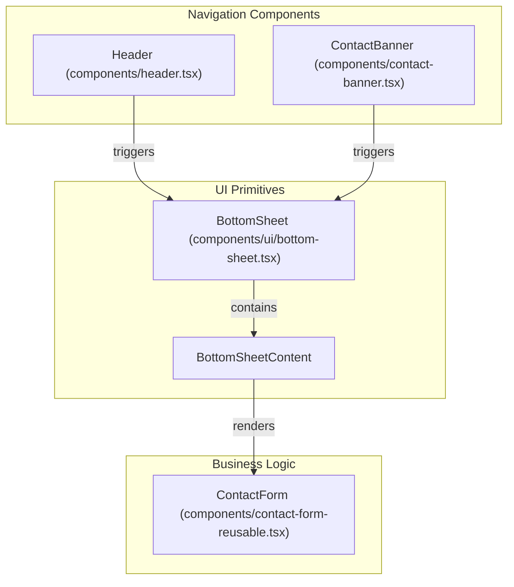
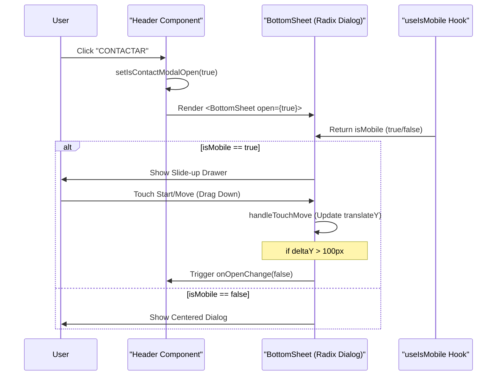

# Layout & Navigation Components

The layout and navigation system in LegalOrbis provides a consistent user experience across the home page and practice area details. It manages scroll-dependent styling, active section tracking for single-page navigation, and a unified contact modal pattern that adapts to mobile and desktop viewports.

## Header Component

The `Header` component serves as the primary navigation hub. It implements a "sticky" behavior that transitions between a transparent state (at the top of the page) and a solid, shadowed state upon scrolling.

### Scroll and Section Tracking
The component uses a `useEffect` hook to monitor the `window.scrollY` position [components/header.tsx:19-51](). 
- **Scroll Awareness**: If the scroll position exceeds 100px, `isScrolled` is set to true, triggering a CSS transition from `bg-black/20` to `bg-white/95` [components/header.tsx:70-74]().
- **Active Section Tracking**: On the home page, the header calculates which section is currently in view by comparing the scroll position against the `offsetTop` and `offsetHeight` of specific DOM elements (`hero`, `quienes-somos`, `areas-juridicas`, `contacto`) [components/header.tsx:24-45]().

### Navigation Logic
- **Smooth Scrolling**: The `scrollToSection` function uses `element.scrollIntoView({ behavior: 'smooth' })` to navigate to home page anchors [components/header.tsx:53-61]().
- **Dynamic Assets**: The brand logo toggles between `LegalOrbisWhite.png` and `LegalOrbis.png` based on the `isScrolled` state [components/header.tsx:84-95]().

### Mobile Navigation
A hamburger menu is implemented for mobile devices. It toggles the `isMobileMenuOpen` state, which renders a full-screen overlay containing the navigation links [components/header.tsx:163-200]().

**Sources:**
- `components/header.tsx` [11-200]()

---

## Footer Component

The `Footer` component provides organizational information, office locations, and quick access to site sections.

### Structure and Content
- **Office Info**: Displays the Madrid office address and contact details [components/footer.tsx:41-56]().
- **Quick Links**: Maps through a `quickLinks` array to provide navigation to internal sections using the `scrollToSection` helper [components/footer.tsx:13-18]().
- **Copyright**: Automatically updates the year using `new Date().getFullYear()` [components/footer.tsx:102-103]().

### Interaction
The footer includes a direct link to the contact section (`#contacto`), ensuring users have a clear path to conversion at the end of every page [components/footer.tsx:84-91]().

**Sources:**
- `components/footer.tsx` [5-115]()

---

## Contact Modal Pattern

LegalOrbis uses a unified pattern for the contact form, leveraging the `BottomSheet` component. This pattern is triggered from the `Header`, the `ContactBanner`, and various CTA buttons.

### Implementation: BottomSheet & Dialog
The `BottomSheet` component is a wrapper around Radix UI's `DialogPrimitive` [components/ui/bottom-sheet.tsx:4-32](). It dynamically changes its behavior based on the device:
- **Desktop**: Renders as a centered modal (`Dialog`) [components/ui/bottom-sheet.tsx:134-150]().
- **Mobile**: Renders as a drawer that slides up from the bottom [components/ui/bottom-sheet.tsx:100-131]().

### Component Relationship Diagram
This diagram shows how the `Header` and `ContactBanner` interact with the `BottomSheet` primitive to render the `ContactForm`.

**Sources:**
- `components/header.tsx` [141-160]()
- `components/contact-banner.tsx` [70-82]()
- `components/ui/bottom-sheet.tsx` [28-175]()

### Data Flow: Modal Interaction
The following diagram illustrates the state management for opening the contact modal and the touch-drag logic for mobile users.

**Sources:**
- `components/ui/bottom-sheet.tsx` [12-26]() (useIsMobile)
- `components/ui/bottom-sheet.tsx` [65-98]() (Touch handlers)
- `components/header.tsx` [15-16]() (State)

---

## Reusable UI Integration

The layout components rely on several `components/ui/` primitives to maintain visual consistency:

| Component | Usage in Layout | File Reference |
| :--- | :--- | :--- |
| `Button` | Navigation links and CTA triggers | [components/ui/button.tsx]() |
| `BottomSheet` | Wraps the contact form in Header and Banner | [components/ui/bottom-sheet.tsx:28]() |
| `CSSAnimatedSection` | Provides entrance animations for Banner content | [components/ui/css-animated-section.tsx]() |
| `ValorDialog` | Reuses the BottomSheet pattern for "Firm Values" | [components/ui/valor-dialog.tsx:17]() |

**Sources:**
- `components/contact-banner.tsx` [27-43]()
- `components/ui/valor-dialog.tsx` [1-51]()

---
