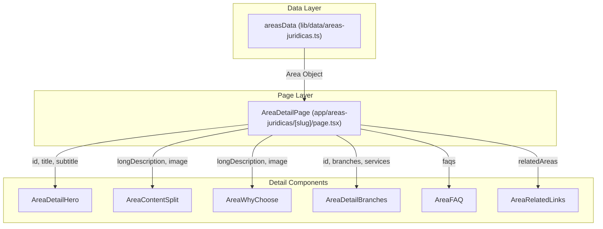
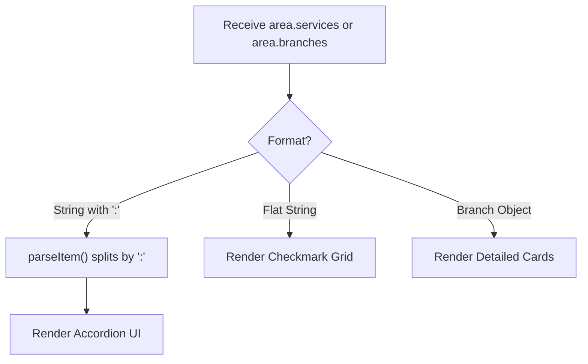

# Legal Area Detail Components
The Legal Area Detail components are a specialized suite of React components designed to render the practice area pages (e.g., `/areas-juridicas/penal`). These components are optimized for high-readability legal content, featuring sophisticated typography, CSS-driven animations, and a data-driven architecture that consumes the `areasData` model.

## Component Overview and Data Flow

The data flow for these components starts at the dynamic route `app/areas-juridicas/[slug]/page.tsx`, which fetches the relevant `AreaData` object from `lib/data/areas-juridicas.ts`. This object is then passed down as props to the various detail components.

### Data Flow Diagram

The following diagram illustrates how the central data store populates the specific UI components on a practice area page.

**Data Propagation to Detail Components**

**Sources:** [lib/data/areas-juridicas.ts:1-10](), [components/area-detail-hero.tsx:6-15](), [components/area-detail-branches.tsx:8-15]()

---

## Component Technical Details

### AreaDetailHero
The entry point of the detail page. It displays the area title, a descriptive subtitle, and a large decorative background number corresponding to the practice area's index.

*   **Implementation:** Uses `CSSAnimatedSection` with `fadeInLeft` and `fadeInUp` variants [components/area-detail-hero.tsx:25-40]().
*   **Visual Elements:** Features a large background digit rendered with `text-white/10` and a `blur-3xl` gradient overlay [components/area-detail-hero.tsx:50-70]().

### AreaContentSplit & AreaDetailContent
These components handle the primary textual description of the legal area. 

*   **AreaContentSplit:** Typically used for the introduction. It extracts the first paragraph from `longDescription` (by splitting on `\n\n`) and pairs it with an optimized `next/image` [components/area-content-split.tsx:16-21]().
*   **AreaDetailContent:** A more complex layout used for longer narratives. It features a desktop-specific "zigzag" layout where text is split across the top and bottom of a central image [components/area-detail-content.tsx:70-128]().

### AreaDetailBranches
This component manages the display of specific legal sub-specialties. It is highly polymorphic and adjusts its rendering logic based on the data format.

*   **Simple List:** If the data is a flat array of strings, it renders a grid of checkmark items [components/area-detail-branches.tsx:143-170]().
*   **Accordion Format:** If items contain a colon (`:`), it parses them into title/detail pairs and renders an interactive accordion [components/area-detail-branches.tsx:95-139]().
*   **Complex Branches:** If the data contains `Branch` objects, it renders detailed cards with descriptions [components/area-detail-branches.tsx:173-180]().

**Branch Parsing Logic**

**Sources:** [components/area-detail-branches.tsx:20-50](), [components/area-detail-branches.tsx:95-170]()

### AreaWhyChoose
Focuses on the firm's value proposition for that specific area.
*   **Data Handling:** It skips the first paragraph (used by `AreaContentSplit`) and renders the remaining paragraphs from `longDescription` [components/area-why-choose.tsx:23-28]().
*   **Interactivity:** Includes a CTA button that triggers a `BottomSheet` containing a `ContactForm` [components/area-why-choose.tsx:74-88]().

### AreaFAQ
Renders a practice-area-specific FAQ section.
*   **State Management:** Uses a local `openIndex` state to manage accordion toggling [components/area-faq.tsx:21-26]().
*   **SEO:** While this component handles the UI, the corresponding JSON-LD structured data is injected at the page level using `generateFAQSchema` [lib/seo/schema.ts:1-10]().

### AreaRelatedLinks
Provides cross-linking between different practice areas to improve SEO and user retention.
*   **Filtering:** Automatically filters out the `currentAreaId` and limits the display to 3 related areas [components/area-related-links.tsx:23-25]().
*   **Styling:** Uses a dark teal background (`#1A3635`) with white text and hover-transformed arrows [components/area-related-links.tsx:32-80]().

---

## Shared Technical Patterns

### Animation System
All components in this suite utilize `CSSAnimatedSection` for entry animations. This component applies Tailwind-based CSS animations (from `tw-animate-css`) when the element enters the viewport.

| Component | Common Animation | Trigger Delay |
| :--- | :--- | :--- |
| Hero | `fadeInLeft` / `fadeInUp` | 0.1s - 0.3s |
| Content | `fadeInScale` | 0.4s - 0.5s |
| Branches | `fadeInUp` / `fadeInScale` | Staggered (index * 0.05s) |

**Sources:** [components/area-detail-branches.tsx:107](), [components/area-detail-hero.tsx:25](), [components/area-content-split.tsx:39]()

### Theming and Visuals
The detail pages use a distinct color palette compared to the home page:
*   **Primary Background:** Deep black (`#0B0B0B`) [components/area-detail-content.tsx:18]() or Dark Teal (`#1A3635`) [components/area-detail-hero.tsx:20]().
*   **Decorative Elements:** Use `animate-pulse` on absolute-positioned divs with high blur (`blur-3xl`) to create a "glowing" effect [components/area-detail-branches.tsx:56-65]().

**Sources:** [components/area-detail-branches.tsx:52-65](), [components/area-detail-hero.tsx:77-80](), [components/area-content-split.tsx:28-34]()
