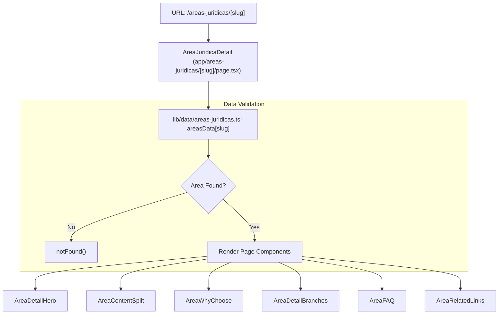
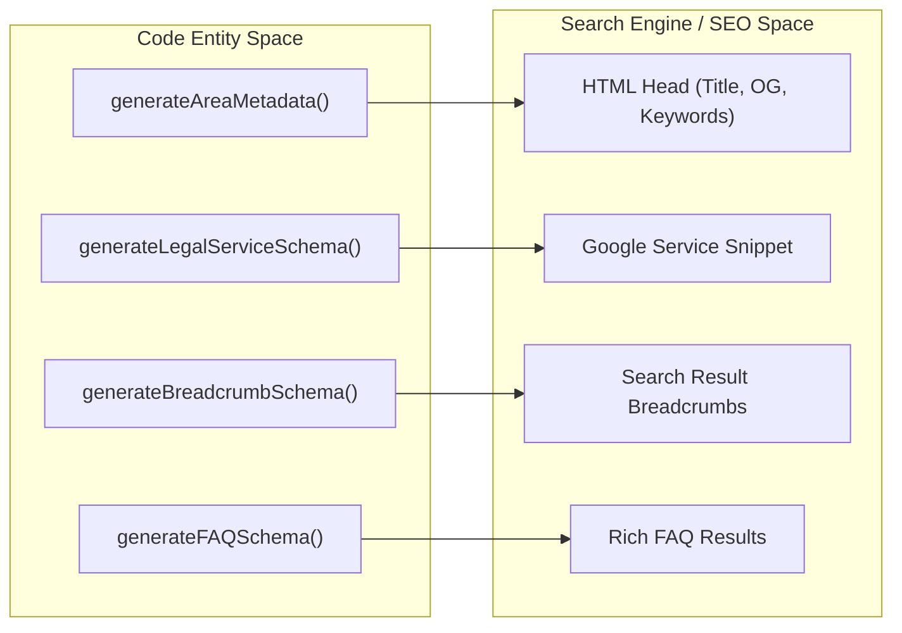

# Legal Area Detail Pages
The Legal Area Detail pages are implemented via a dynamic Next.js route that serves as the deep-content layer for the firm's practice areas. These pages transform static data into SEO-optimized, interactive landing pages using a composition of specialized sub-components.

## Slug Resolution and Data Flow

The route `app/areas-juridicas/[slug]/page.tsx` handles dynamic segments by looking up the `slug` against the `areasData` object [app/areas-juridicas/[slug]/page.tsx:25-25]().

### Request Handling
1. **Slug Extraction**: The component receives `params` as a Promise, awaiting it to retrieve the `slug` [app/areas-juridicas/[slug]/page.tsx:52-52]().
2. **Data Lookup**: It attempts to find the corresponding entry in `areasData` [app/areas-juridicas/[slug]/page.tsx:53-53]().
3. **Error Handling**: If the slug does not match any key in the data model (e.g., `/areas-juridicas/invalid-area`), the system invokes the `notFound()` function [app/areas-juridicas/[slug]/page.tsx:56-58](), which triggers the custom 404 UI.

### Data Flow Diagram
This diagram illustrates how the `slug` moves from the URL to the data layer and finally into the UI components.

**Area Detail Data Resolution**

Sources: [app/areas-juridicas/[slug]/page.tsx:47-126](), [lib/data/areas-juridicas.ts:1-83]()

---

## SEO and Structured Data

Each detail page performs heavy SEO lifting through two primary mechanisms: dynamic metadata generation and JSON-LD schema injection.

### Metadata Generation
The `generateMetadata` function [app/areas-juridicas/[slug]/page.tsx:19-45]() uses the `generateAreaMetadata` factory to create unique titles, descriptions, and OpenGraph tags for every practice area. If an area is not found, it returns "noindex, nofollow" instructions to prevent crawlers from indexing invalid routes [app/areas-juridicas/[slug]/page.tsx:27-36]().

### JSON-LD Injection
The page injects three types of structured data as `application/ld+json` scripts:
*   **LegalService**: Documents the specific legal services offered [app/areas-juridicas/[slug]/page.tsx:61-65]().
*   **BreadcrumbList**: Provides the navigation path (Home > Áreas Jurídicas > Current Area) [app/areas-juridicas/[slug]/page.tsx:67-73]().
*   **FAQPage**: Injected conditionally only if the area has defined FAQs [app/areas-juridicas/[slug]/page.tsx:76-80]().

**SEO Entity Mapping**

Sources: [app/areas-juridicas/[slug]/page.tsx:12-17](), [app/areas-juridicas/[slug]/page.tsx:60-103]()

---

## Component Composition

The page is built from a suite of components that consume the `area` object.

### AreaDetailHero
Displays the primary title, a decorative area number (e.g., "01"), and a high-level subtitle [components/area-detail-hero.tsx:16-45](). It uses a dark teal background (`#1A3635`) to establish the visual theme of the detail pages [components/area-detail-hero.tsx:20-20]().

### AreaContentSplit & AreaWhyChoose
These components handle the `longDescription` field:
*   **AreaContentSplit**: Displays the first paragraph alongside a high-quality image [components/area-content-split.tsx:21-65]().
*   **AreaWhyChoose**: Displays the remaining paragraphs over a full-width background image with an overlay [components/area-why-choose.tsx:23-44](). It includes a `BottomSheet` trigger for the contact form [components/area-why-choose.tsx:74-88]().

### AreaDetailBranches
This component renders the specific legal sub-disciplines. It has complex logic to handle different data formats:
1.  **Simple List**: Renders a grid of cards with checkmarks [components/area-detail-branches.tsx:141-170]().
2.  **Details Format**: If an item contains a colon (":"), it renders an accordion-style toggle where the text after the colon is hidden until expanded [components/area-detail-branches.tsx:95-140]().
3.  **Laboral Exception**: Specifically forces a simple list layout for the Laboral area [components/area-detail-branches.tsx:25-25]().

### AreaFAQ
Renders an accordion of frequently asked questions. It defaults to having the first FAQ expanded (`openIndex: 0`) [components/area-faq.tsx:21-21](). Like `AreaWhyChoose`, it provides a call-to-action button that opens the `ContactFormReusable` within a `BottomSheet` [components/area-faq.tsx:82-96]().

### AreaRelatedLinks
Calculates "Other Areas" by filtering out the current area from the `areasData` object and taking the first three remaining entries [components/area-related-links.tsx:23-25]().

Sources: [components/area-detail-hero.tsx](), [components/area-content-split.tsx](), [components/area-why-choose.tsx](), [components/area-detail-branches.tsx](), [components/area-faq.tsx](), [components/area-related-links.tsx]()
