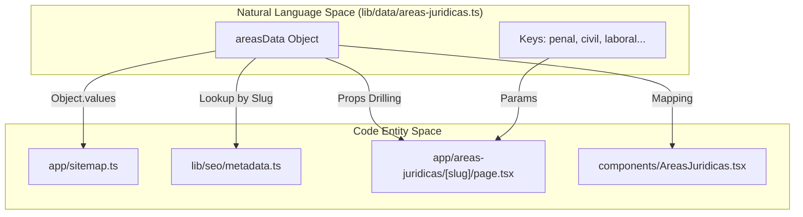
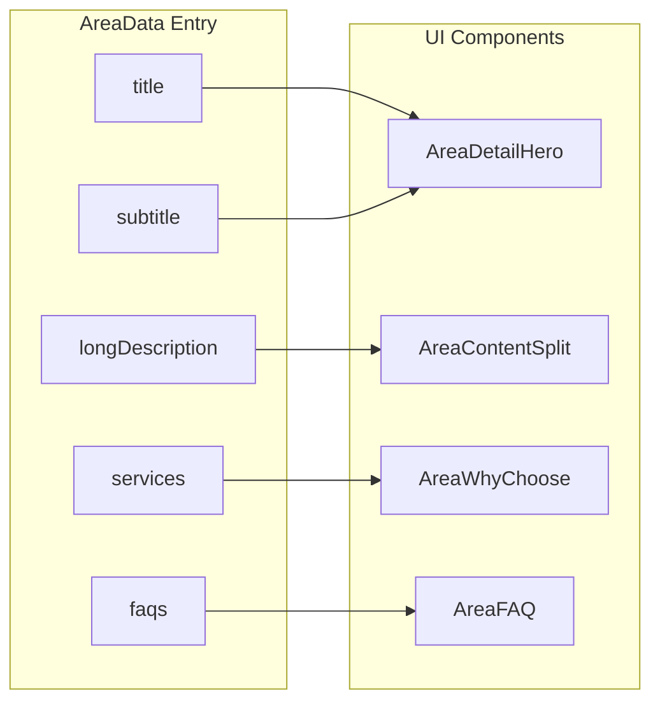

# Legal Areas Data Model
The Legal Orbis platform relies on a centralized data structure to manage its legal practice areas. This model ensures consistency across the user interface, search engine optimization (SEO), and automated site indexing. By decoupling content from presentation, the system can dynamically generate detail pages, metadata, and structured data schemas from a single source of truth.

## Core Data Structures

The data model is defined in `lib/data/areas-juridicas.ts` using TypeScript interfaces to enforce strict typing across the application. The model is built around the `areasData` constant, which serves as the primary registry for all legal specialties.

### Type Definitions

The system utilizes two primary interfaces to describe legal content:

| Interface | Purpose |
| :--- | :--- |
| `Branch` | A simple string representing a specific legal sub-specialty or service line. |
| `AreaData` | A comprehensive object containing marketing copy, SEO tags, service lists, and FAQ items for a specific area. |

### The `areasData` Registry

The `areasData` object is a dictionary where keys are URL slugs (e.g., `penal`, `civil`) and values are `AreaData` objects. The firm currently supports five primary areas:

1.  **Penal**: Criminal and Penitentiary Law [lib/data/areas-juridicas.ts:3-79]().
2.  **Civil**: General Civil Law, Contracts, and Torts [lib/data/areas-juridicas.ts:80-165]().
3.  **Laboral**: Employment and Social Security Law [lib/data/areas-juridicas.ts:166-240]().
4.  **Mercantil**: Corporate and Commercial Law [lib/data/areas-juridicas.ts:241-314]().
5.  **Administrativo**: Public Law and Administrative Procedures [lib/data/areas-juridicas.ts:315-392]().

### FAQ Structure
Each legal area includes an array of `faqs`, which consist of `question` and `answer` strings. This data is used to render the `AreaFAQ` component and to generate `FAQPage` JSON-LD schemas for Google Search [lib/data/areas-juridicas.ts:51-78]().

**Sources:** [lib/data/areas-juridicas.ts:1-392]()

---

## Data Flow & System Integration

The `areasData` constant acts as the "Natural Language Space" source that is transformed into "Code Entity Space" objects throughout the Next.js lifecycle.

### Code Entity Mapping

The following diagram illustrates how the raw data in `areas-juridicas.ts` is consumed by various system modules.

Title: Data Consumption Flow

**Sources:** [lib/data/areas-juridicas.ts:2-3](), [app/sitemap.ts:2-21](), [app/areas-juridicas/[slug]/page.tsx:1-20]()

---

## Key Functions

### getAreaBranches()
While not explicitly exported as a standalone utility in the provided snippets, the logic for extracting branches is embedded within the `AreaData` structure. Each area defines a `branches` array (e.g., `['Defensa penal integral', 'Recursos penales']`) which is used by the `AreaDetailBranches` component to render the service grid [lib/data/areas-juridicas.ts:44-50]().

### Sitemap Generation
The `sitemap.ts` file dynamically iterates over the `areasData` to generate the XML sitemap. This ensures that any new legal area added to the data model is automatically indexed by search engines without manual configuration.

```typescript
// app/sitemap.ts logic
const areaPages = Object.values(areasData).map((area) => ({
  url: `${baseUrl}/areas-juridicas/${area.id}`,
  lastModified: new Date(),
  changeFrequency: 'monthly',
  priority: 0.8,
}));
```
**Sources:** [app/sitemap.ts:15-21]()

---

## SEO and UI Driving Logic

The data model is specifically designed to support the firm's SEO strategy. Each entry in `areasData` contains specific fields that map directly to HTML `<head>` elements and Structured Data.

### Metadata Mapping

| AreaData Field | Usage in System |
| :--- | :--- |
| `metaTitle` | Injected into `generateAreaMetadata` for the `<title>` tag [lib/data/areas-juridicas.ts:12](). |
| `metaDescription` | Used for the `description` meta tag and OpenGraph/Twitter cards [lib/data/areas-juridicas.ts:13-14](). |
| `metaKeywords` | Combined with base keywords to populate the `keywords` meta tag [lib/data/areas-juridicas.ts:15-28](). |
| `image` | Used as the OG Image and Hero background for the specific area [lib/data/areas-juridicas.ts:29](). |

### UI Rendering Architecture

The dynamic route `app/areas-juridicas/[slug]/page.tsx` uses the `slug` parameter to fetch the corresponding object from `areasData`. This object is then passed to specialized components:

Title: UI Component Data Binding


**Sources:** [lib/data/areas-juridicas.ts:4-78](), [app/sitemap.ts:16-21](), [app/robots.ts:3-36]()
