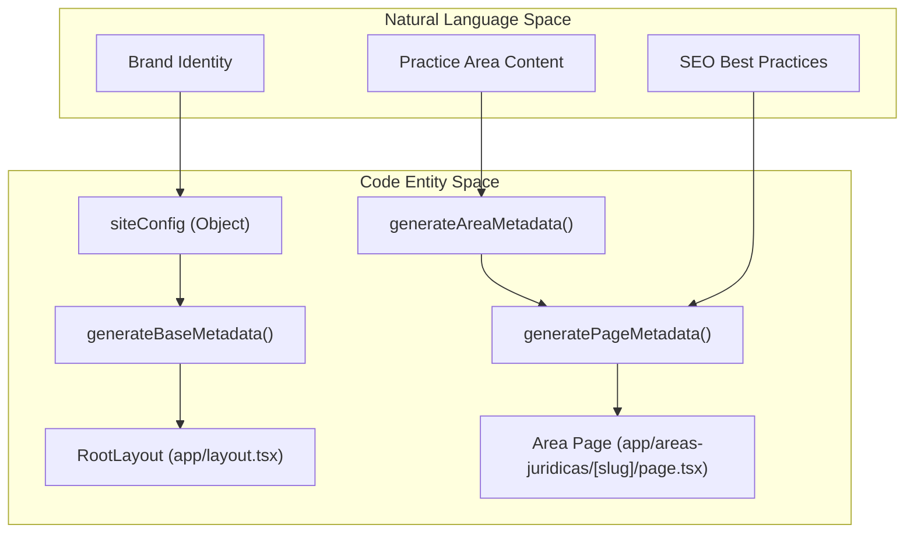
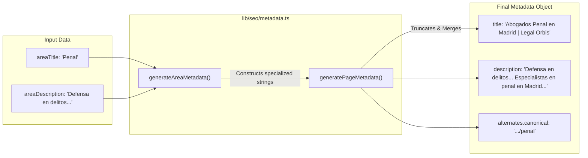

# Metadata Generation

The metadata generation system in LegalOrbis provides a centralized, type-safe approach to managing Search Engine Optimization (SEO) tags across the application. It utilizes the Next.js Metadata API to generate standard meta tags, OpenGraph data, Twitter cards, and favicon references dynamically based on the page context.

## Core Configuration

The foundation of the SEO system is the `siteConfig` object, which contains the global brand identity and default values used across the entire site.

| Property | Value / Purpose |
| :--- | :--- |
| `name` | "Legal Orbis Abogados" - Used in title templates. |
| `url` | `https://www.legalorbisabogados.es` - Base URL for canonicals. |
| `ogImage` | `/LegalOrbis.svg` - Default social sharing image. |
| `keywords` | Array of 10 primary legal service keywords in Madrid. |
| `robots` | Configured to `index: true, follow: true` with specific GoogleBot snippet rules. |

**Sources:** [lib/seo/metadata.ts:4-36]()

---

## System Architecture

The metadata system follows a hierarchical pattern where base metadata is defined at the root and specialized functions extend or override these values for specific pages.

### Metadata Flow Diagram

"Metadata Generation Logic"

**Sources:** [lib/seo/metadata.ts:4-181](), [app/layout.tsx:25-25]()

---

## Implementation Details

### Base Metadata
The `generateBaseMetadata()` function creates the initial configuration used in the root layout. It establishes the title template `%s | Legal Orbis Abogados`, which allows child pages to inject their own title while maintaining brand consistency.

Key features include:
*   **Metadata Base:** Sets the root URL for resolving relative asset paths [lib/seo/metadata.ts:41-41]().
*   **Icon Suite:** Defines a comprehensive set of favicons including `.ico`, `.svg`, and various `.png` sizes for modern browsers and Apple devices [lib/seo/metadata.ts:74-89]().
*   **OpenGraph/Twitter:** Standardizes the locale (`es_ES`) and card types (`summary_large_image`) [lib/seo/metadata.ts:52-73]().

**Sources:** [lib/seo/metadata.ts:39-97](), [app/layout.tsx:25-25]()

### Page Metadata Factory
The `generatePageMetadata()` function serves as a utility for individual routes. It implements specific logic to ensure SEO compliance:

*   **Description Truncation:** If a description exceeds 160 characters, it is truncated to 157 characters followed by an ellipsis (`...`) to fit within Google search result limits [lib/seo/metadata.ts:114-117]().
*   **Keyword Merging:** It automatically merges page-specific keywords with the global `siteConfig.keywords` array [lib/seo/metadata.ts:122-122]().
*   **Canonical Resolution:** Dynamically constructs the canonical URL by appending the provided path to the base site URL [lib/seo/metadata.ts:146-146]().

**Sources:** [lib/seo/metadata.ts:100-149]()

### Legal Area Metadata
The `generateAreaMetadata()` function is a specialized factory for practice area detail pages. It follows a specific SEO pattern for the legal industry:

1.  **Title Pattern:** `Abogados [Area] en Madrid | Legal Orbis` [lib/seo/metadata.ts:165-165]().
2.  **Description Pattern:** `[Description] Especialistas en [area] en Madrid. Consulta gratuita.` [lib/seo/metadata.ts:166-166]().
3.  **Keyword Injection:** Automatically generates localized keywords like `derecho [area] Madrid` and `defensa [area] Madrid` [lib/seo/metadata.ts:171-177]().

**Sources:** [lib/seo/metadata.ts:152-181]()

---

## Data Transformation Mapping

The following diagram illustrates how raw input data is transformed into standardized SEO metadata through the internal functions.

"Metadata Transformation Mapping"

**Sources:** [lib/seo/metadata.ts:100-181]()

## Summary of Metadata Properties

| Function | Title Logic | Description Logic | Canonical Logic |
| :--- | :--- | :--- | :--- |
| `generateBaseMetadata` | Uses `siteConfig.name` | Uses `siteConfig.description` | `siteConfig.url` |
| `generatePageMetadata` | `title | siteConfig.name` | Truncated to 160 chars | `siteConfig.url + url` |
| `generateAreaMetadata` | `Abogados [Area] en Madrid...` | Appends "Especialistas en..." | `siteConfig.url + areaUrl` |

**Sources:** [lib/seo/metadata.ts:39-181]()

---
