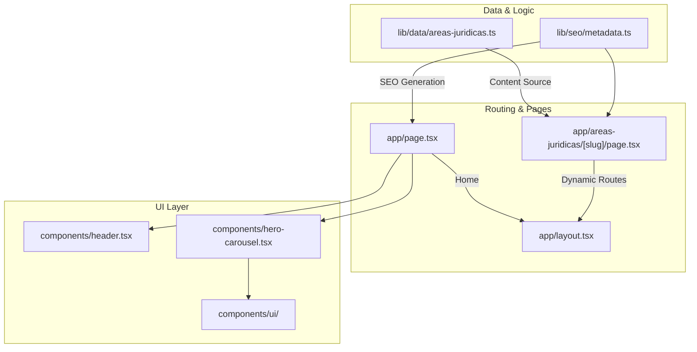
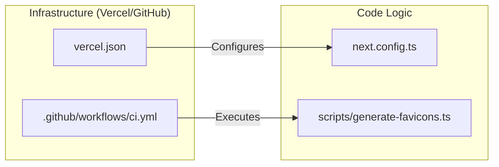

# Overview
LegalOrbis is the official corporate web platform for **LegalOrbis**, a multidisciplinary law firm based in Madrid [CLAUDE.md:3-5](). The application serves as a high-performance, SEO-optimized digital storefront showcasing the firm's expertise in Criminal, Civil, Labor, and Penitentiary law [app/page.tsx:7-22]().

The codebase is designed as a static-first corporate site leveraging modern React patterns, dynamic component loading for performance, and a robust automated asset pipeline.

## Tech Stack

The project is built on a modern frontend stack focused on performance, type safety, and fluid animations.

| Category | Technology |
| :--- | :--- |
| **Framework** | Next.js 16 (App Router) [package.json:22]() |
| **Runtime/Language** | Node.js 20+, TypeScript 5 [package.json:30,40]() |
| **UI / Styling** | Tailwind CSS 4, Radix UI, Lucide React [package.json:14-21,36]() |
| **Animations** | Framer Motion, Embla Carousel [package.json:19-20]() |
| **Deployment** | Vercel [CLAUDE.md:35]() |

**Sources:** [package.json:1-42](), [CLAUDE.md:7-9]()

## System Architecture

The following diagram illustrates how the core subsystems interact, bridging the Natural Language concepts to the specific Code Entities.

### Code Entity Relationship

**Sources:** [app/page.tsx:1-56](), [CLAUDE.md:21-29]()

## Major Subsystems

### 1. Developer Onboarding
The project uses standard `npm` scripts for development and maintenance. A specialized `generate-favicons` script is included to manage brand assets via Sharp and `to-ico`.
*   For setup instructions, see **[Getting Started](#1.1)**.

### 2. Project Organization
The repository follows the Next.js App Router convention with a clear separation between page logic (`app/`), reusable components (`components/`), and business logic/data (`lib/`).
*   For a deep dive into the directory layout, see **[Project Structure](#1.2)**.

### 3. Dynamic Content Engine
The site's primary content (Legal Areas) is driven by a centralized data model in `lib/data/`. This data populates both the UI components and the SEO metadata generators dynamically.
*   **Key Data Structure:** `areasData` constant in `lib/data/areas-juridicas.ts`.
*   **Metadata:** Managed via `generatePageMetadata` and `generateAreaMetadata` [app/page.tsx:7-24]().

### 4. CI/CD and Infrastructure
The project includes a GitHub Actions workflow for automated linting and building on every push to `dev` or `main` branches.
*   **CI Workflow:** `.github/workflows/ci.yml` [ci.yml:1-31]().
*   **Dependency Management:** Automated via Renovate [renovate.json:1-25]().

### Infrastructure to Code Mapping

**Sources:** [vercel.json:1-20](), [next.config.ts:1-50](), [package.json:11]()
