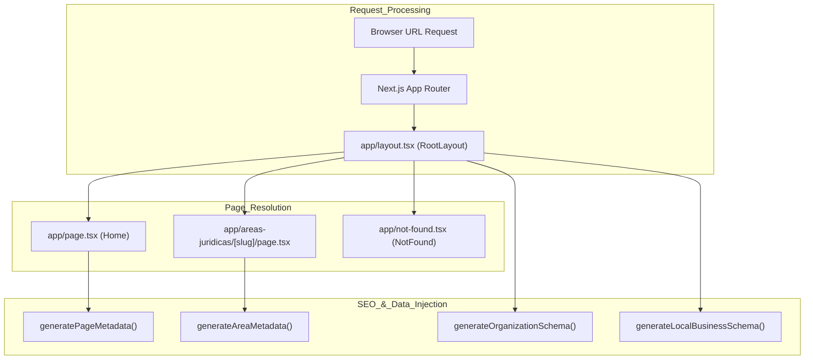
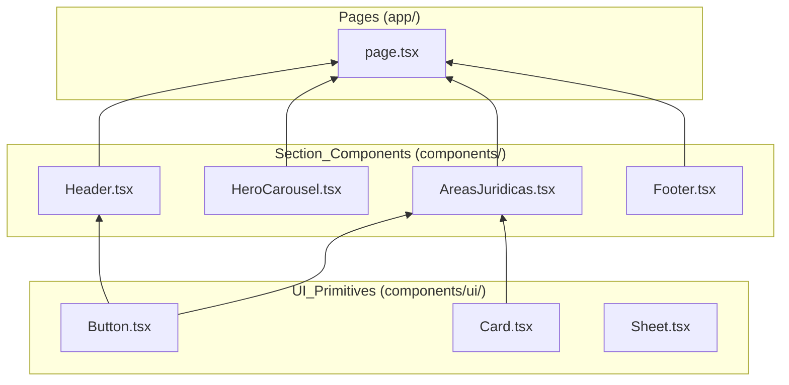

# Project Structure

The LegalOrbis codebase is organized following the **Next.js App Router** architecture, optimized for a high-performance corporate legal website. It utilizes a modular structure where concerns are strictly separated between routing, UI components, data models, and SEO utilities.

## Directory Overview

The project structure is designed to support static generation with dynamic client-side interactivity (Framer Motion, Embla Carousel) and robust SEO via structured data schemas.

| Directory | Purpose | Key Contents |
| :--- | :--- | :--- |
| `app/` | Routing & Page Layouts | Routes, `layout.tsx`, `not-found.tsx`, and `sitemap.ts`. |
| `components/` | React Components | Section-level components (e.g., `HeroCarousel`) and UI primitives. |
| `hooks/` | Custom React Hooks | Reusable logic like `useContactForm`. |
| `lib/` | Core Logic & Data | Practice area data, SEO metadata generators, and utility functions. |
| `scripts/` | Build-time Scripts | Favicon generation and asset processing. |
| `types/` | TypeScript Definitions | Shared interfaces and third-party type augmentations. |
| `public/` | Static Assets | Images, manifest, and generated favicons. |

**Sources:** [CLAUDE.md:21-29](), [app/layout.tsx:1-69]()

---

## Routing & Page Architecture (`app/`)

LegalOrbis uses the **Next.js App Router** conventions. The root of the application is defined in `app/layout.tsx`, which wraps all pages with global providers, fonts, and base SEO configurations.

### Root Layout and Global Config
The `RootLayout` component in `app/layout.tsx` serves as the entry point for the DOM structure. It initializes:
- **Fonts:** Geist Sans and Geist Mono via `next/font/google` [app/layout.tsx:11-23]().
- **SEO Metadata:** Base metadata generated via `generateBaseMetadata()` [app/layout.tsx:25]().
- **Structured Data:** Injects `Organization` and `LocalBusiness` JSON-LD schemas into the `<head>` [app/layout.tsx:32-56]().

### Error Handling
The `app/not-found.tsx` file provides a custom 404 experience. It uses a `main` container with a gradient background and provides navigation buttons to return to the home page or practice areas [app/not-found.tsx:16-47](). It explicitly sets `robots: { index: false }` to prevent search engines from indexing error pages [app/not-found.tsx:10-13]().

### Request Flow Diagram
The following diagram illustrates how a request is handled by the `app/` directory and which code entities are invoked.

**Title: Next.js App Router Request Flow**

**Sources:** [app/layout.tsx:27-68](), [app/page.tsx:7-24](), [app/not-found.tsx:16-49]()

---

## Component Organization (`components/`)

Components are divided into two distinct layers to maximize reusability and maintainability:

1.  **Section Components:** Large, page-specific blocks (e.g., `HeroCarousel`, `QuienesSomos`, `AreasJuridicas`) [app/page.tsx:47-53]().
2.  **UI Primitives:** Atomic components found in `components/ui/` (e.g., `Button`, `Card`, `Carousel`) [app/not-found.tsx:5]().

### Dynamic Loading Strategy
To optimize the Initial Page Load, the Home Page (`app/page.tsx`) uses `next/dynamic` to lazy-load sections below the fold, such as `QuienesSomos`, `VideoBanner`, and `AreasJuridicas` [app/page.tsx:26-42]().

**Title: Component Hierarchy and Data Flow**

**Sources:** [app/page.tsx:1-42](), [app/not-found.tsx:3-5]()

---

## Data and Logic (`lib/`)

The `lib/` directory contains the "brain" of the application, separating business data from UI logic.

-   **`lib/data/`**: Contains `areas-juridicas.ts`, the single source of truth for practice area content, FAQs, and slugs.
-   **`lib/seo/`**: Houses metadata and schema generators.
    -   `metadata.ts`: Logic for `generateBaseMetadata`, `generatePageMetadata`, and `generateAreaMetadata` [app/page.tsx:5]().
    -   `schema.ts`: Logic for creating JSON-LD scripts [app/layout.tsx:4-9]().
-   **`lib/utils.ts`**: Contains the `cn()` utility, which merges Tailwind classes using `clsx` and `tailwind-merge`.

**Sources:** [app/layout.tsx:4-9](), [app/page.tsx:5-24]()

---

## Static Assets and Infrastructure

### Public Directory (`public/`)
Stores static assets like the `site.webmanifest` [app/layout.tsx:60](). It also contains the favicon suite (e.g., `favicon-48x48.png`) generated by automated scripts [public/favicon-48x48.png:1-17]().

### Scripts (`scripts/`)
The `scripts/generate-favicons.ts` utility is used to process a source SVG into the various PNG and ICO formats required for modern browsers and mobile devices [CLAUDE.md:18]().

### CI/CD Configuration
The project includes a GitHub Actions workflow in `.github/workflows/ci.yml` that executes `npm run lint` and `npm run build` on every push to `dev` or `main` branches to ensure code quality [ .github/workflows/ci.yml:1-31](). Dependency updates are managed by Renovate, with specific rules for Next.js and React packages [renovate.json:1-25]().

**Sources:** [CLAUDE.md:11-19](), [.github/workflows/ci.yml:1-31](), [renovate.json:1-25]()

---
