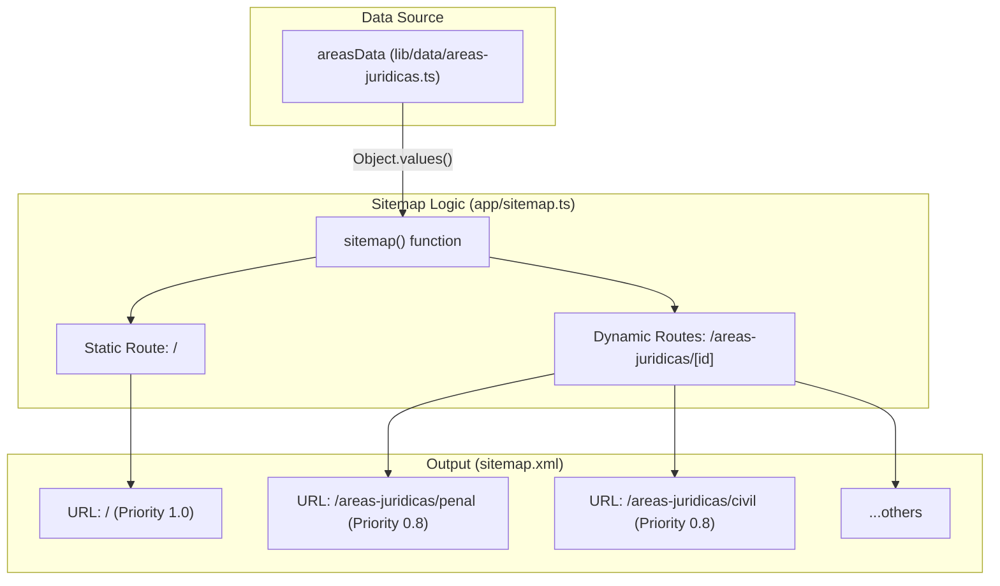
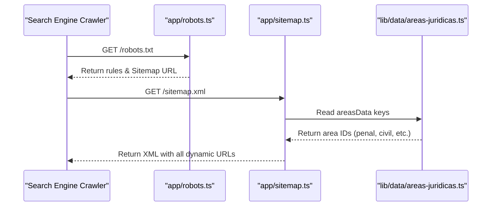

# Robots & Sitemap

This section documents the automated search engine optimization (SEO) infrastructure of the LegalOrbis application. It covers the dynamic generation of the `robots.txt` file and the `sitemap.xml` file, which together guide web crawlers in indexing the site effectively.

## Robots Configuration (`robots.ts`)

The file `app/robots.ts` utilizes the Next.js `MetadataRoute.Robots` type to define crawling rules for search engines. It ensures that essential assets are accessible while protecting private or internal server routes from indexing.

### Implementation Details
The configuration specifies a `baseUrl` of `https://www.legalorbisabogados.es` [app/robots.ts:4-4]() and defines a set of rules applied to all user agents (`*`) [app/robots.ts:8-8]().

**Allow Rules:**
*   **Static Assets:** Explicitly allows `/_next/static/` and `/_next/image` to ensure Google and other crawlers can render the page correctly using optimized images [app/robots.ts:11-13]().
*   **Favicon v2:** Specifically allows the versioned favicon assets (e.g., `favicon-v2.ico`, `favicon-48x48-v2.png`) generated by the asset pipeline [app/robots.ts:15-17]().
*   **Legacy Assets:** Allows access to legacy favicon paths and the `/images/` directory to follow redirects and index original media [app/robots.ts:19-24]().

**Disallow Rules:**
*   **Internal Routes:** Blocks access to `/api/`, `/admin/`, `/private/`, and the Next.js internal server directory `/_next/server/` [app/robots.ts:27-32]().

The function also provides the absolute URL to the sitemap [app/robots.ts:34-34]().

**Sources:**
* [app/robots.ts:1-36]()

---

## Sitemap Generation (`sitemap.ts`)

The `app/sitemap.ts` file dynamically generates the site map by combining static routes with dynamic routes derived from the legal practice areas data.

### Data Flow and Logic
The sitemap is constructed using the `areasData` object from the application's data layer [app/sitemap.ts:2-2]().

1.  **Home Page:** Defined with the highest priority (`1.0`) and a `monthly` change frequency [app/sitemap.ts:8-13]().
2.  **Dynamic Area Pages:** The function iterates over `Object.values(areasData)` to generate URLs for every practice area defined in the system (e.g., `/areas-juridicas/penal`, `/areas-juridicas/civil`) [app/sitemap.ts:16-17]().
3.  **Attributes:** Each dynamic page is assigned a priority of `0.8` and a `monthly` change frequency [app/sitemap.ts:19-20]().

### Sitemap Structure Diagram
The following diagram illustrates how the `sitemap()` function transforms internal data into the XML structure.

**Sitemap Data Transformation**

**Sources:**
* [app/sitemap.ts:1-25]()
* [lib/data/areas-juridicas.ts:2-80]()

---

## Crawler Interaction Flow

This diagram maps the interaction between external Search Engine Crawlers and the code entities responsible for guiding them.

**Crawler Guidance Flow**

### Configuration Summary

| Feature | Code Entity | Configuration / Value |
| :--- | :--- | :--- |
| **Base URL** | `baseUrl` | `https://www.legalorbisabogados.es` |
| **Root Priority** | `homePage.priority` | `1.0` |
| **Area Priority** | `areaPages.priority` | `0.8` |
| **Change Freq** | `changeFrequency` | `monthly` |
| **Allowed Paths** | `robots.rules.allow` | `/_next/static/`, `/_next/image`, `/favicon-v2.ico`, etc. |
| **Blocked Paths** | `robots.rules.disallow` | `/api/`, `/admin/`, `/_next/server/` |

**Sources:**
* [app/robots.ts:4-35]()
* [app/sitemap.ts:5-23]()

---
