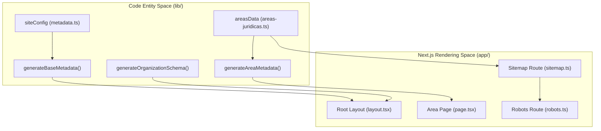
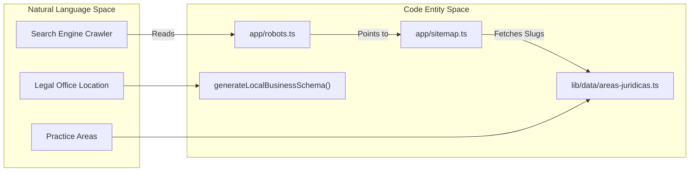

# SEO & Structured Data

The LegalOrbis SEO architecture is designed to maximize visibility for legal services in the Madrid region. It leverages Next.js 15 metadata APIs, automated JSON-LD schema generation, and dynamic sitemap construction to ensure that every practice area is indexed with high precision.

### System Overview

The SEO subsystem is divided into three primary functional areas:
1.  **Metadata Management**: Dynamic generation of HTML tags (title, description, OpenGraph, Twitter) for every route.
2.  **Structured Data**: Generation of JSON-LD schemas to enable Google Rich Results (LocalBusiness, LegalService, FAQ, etc.).
3.  **Crawler Orchestration**: Automated generation of `sitemap.xml` and `robots.txt` based on the application's data layer.

### SEO Data Flow

The following diagram illustrates how the system transforms internal configuration and practice area data into SEO-compliant output.

**SEO Generation Architecture**

**Sources:** [lib/seo/metadata.ts:4-36](), [lib/seo/schema.ts:121-196](), [app/layout.tsx:25-33](), [app/sitemap.ts:15-21]().

---

### Metadata Generation

Metadata is centralized in `lib/seo/metadata.ts`. The system uses a `siteConfig` object as a single source of truth for global values like the site name, base URL, and default keywords [lib/seo/metadata.ts:4-36]().

*   **Global Metadata**: The `generateBaseMetadata()` function is invoked in the root `layout.tsx` to set default titles, OpenGraph tags, and favicon definitions [lib/seo/metadata.ts:39-97]().
*   **Page-Specific Metadata**: The `generatePageMetadata()` utility handles logic for description truncation (max 160 characters) and keyword merging [lib/seo/metadata.ts:100-149]().
*   **Practice Area Factory**: `generateAreaMetadata()` provides a specialized factory for dynamic routes under `/areas-juridicas/[slug]`, automatically appending location-based keywords like "Madrid" to service titles [lib/seo/metadata.ts:152-181]().

For details, see [Metadata Generation](#5.1).

---

### JSON-LD Structured Data

Structured data is generated via a suite of TypeScript functions in `lib/seo/schema.ts`. These functions return objects compliant with `Schema.org` standards, which are then injected into the `<head>` of pages using `<script type="application/ld+json">`.

| Schema Type | Purpose | Implementation |
| :--- | :--- | :--- |
| **Organization** | Defines the firm's identity and logo. | `generateOrganizationSchema()` [lib/seo/schema.ts:121]() |
| **LocalBusiness** | Provides office location, phone, and geo-coordinates. | `generateLocalBusinessSchema()` [lib/seo/schema.ts:199]() |
| **LegalService** | Specific details for Penal, Civil, etc. | `generateLegalServiceSchema()` [lib/seo/schema.ts:234]() |
| **Breadcrumb** | Enhances SERP snippets with navigation paths. | `generateBreadcrumbSchema()` [lib/seo/schema.ts:265]() |
| **FAQ** | Enables collapsible FAQ snippets in search results. | `generateFAQSchema()` [lib/seo/schema.ts:283]() |

For details, see [JSON-LD Structured Data Schemas](#5.2).

---

### Robots & Sitemap

The application uses Next.js dynamic route handlers to generate crawler instructions.

*   **Sitemap**: `app/sitemap.ts` dynamically iterates over the `areasData` object to generate URLs for every practice area, assigning a priority of `0.8` to area pages and `1.0` to the homepage [app/sitemap.ts:8-23]().
*   **Robots**: `app/robots.ts` configures crawler rules, explicitly allowing access to optimized Next.js images and favicon assets while blocking private paths like `/admin/` or `/_next/server/` [app/robots.ts:7-35]().

**Crawler Instruction Mapping**

**Sources:** [app/robots.ts:1-37](), [app/sitemap.ts:1-25](), [lib/seo/schema.ts:199-231]().

For details, see [Robots & Sitemap](#5.3).

---
