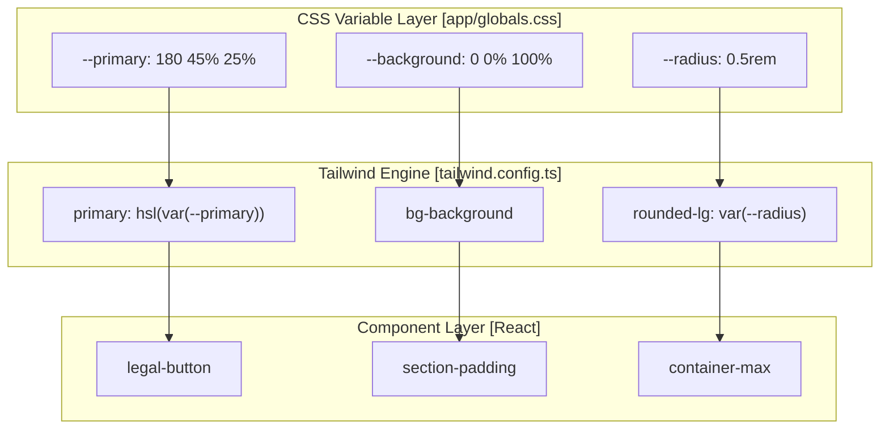
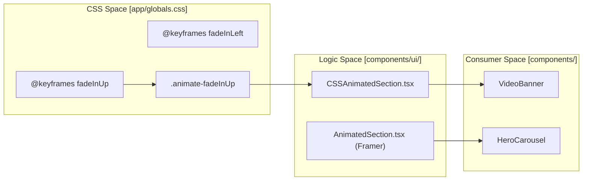

# Styling & Theming
LegalOrbis utilizes a modern styling stack centered around **Tailwind CSS 4** and **CSS Custom Properties**. The system is designed for high performance, utilizing a combination of CSS-native animations and Framer Motion for interactive elements. The brand identity is codified into a specific teal-based color palette that adapts to both light and dark modes.

## Architecture Overview

The styling architecture is divided into three primary layers:
1.  **Tokens & Variables**: Definition of the brand color palette and system spacing using CSS variables.
2.  **Tailwind Integration**: Configuration of the utility engine to map these variables to functional classes.
3.  **Utility Components**: High-level CSS classes for recurring design patterns (e.g., gradients, buttons).

### Visual Styling Flow

The following diagram illustrates how raw CSS variables flow through the Tailwind engine to become usable utility classes in React components.

**Styling Pipeline: Tokens to UI**

Sources: [app/globals.css:46-80](), [tailwind.config.ts:14-74](), [app/globals.css:162-176]()

## Brand Color System

The "Legal Orbis Teal" is the core of the visual identity. It is implemented using HSL values to allow for easy opacity manipulation and dark mode adjustments.

| Token Name | Hex / Value | Role |
| :--- | :--- | :--- |
| `legal-primary` | `#1a5f5f` | Main brand teal (Dark) |
| `legal-secondary`| `#5eb4d4` | Bright accent blue |
| `legal-accent` | `#2d7a7a` | Medium teal for UI elements |
| `legal-dark` | `#0d3d3d` | Deep teal for high contrast |
| `--primary` | `180 45% 25%` | Primary button/link color (Light Mode) |
| `--primary` | `180 45% 35%` | Primary button/link color (Dark Mode) |

Sources: [tailwind.config.ts:16-22](), [app/globals.css:54-54](), [app/globals.css:89-89]()

## Global Styles & Custom Utilities

Beyond standard Tailwind utilities, the codebase defines a set of "Legal Orbis" specific classes in the `@layer components` section of the global stylesheet. These classes encapsulate complex styles like the brand gradient and standard section layouts.

*   **Gradients**: `.legal-gradient` and `.legal-text-gradient` use the brand teal-to-blue transition [app/globals.css:142-151]().
*   **Layout Primitives**: `.section-padding` (standardized vertical spacing) and `.container-max` (max-width of 1600px) ensure consistency across the landing page and detail views [app/globals.css:170-176]().
*   **Buttons**: `.legal-button` and `.legal-button-secondary` provide pre-styled interactive elements that follow the brand's rounded-corner and transition specs [app/globals.css:162-168]().

For a full list of variables and utility classes, see **[Global Styles & CSS Variables](#6.1)**.

## Animation Strategy

LegalOrbis uses a dual-track animation strategy to balance performance and interactivity:

1.  **CSS-Native Animations**: Defined in `app/globals.css`, these use `@keyframes` (like `fadeInUp` and `fadeInLeft`) for scroll-triggered entrance effects. They are orchestrated by the `CSSAnimatedSection` component [app/globals.css:197-255]().
2.  **Framer Motion**: Used for complex state-driven animations, such as the `HeroCarousel` or the `QuienesSomos` dot navigation, where JS-based control is required.

**Animation Logic Association**

Sources: [app/globals.css:197-243](), [components/video-banner.tsx:30-45](), [tailwind.config.ts:75-93]()

For details on PostCSS integration and animation configuration, see **[Tailwind Configuration & Animation](#6.2)**.
