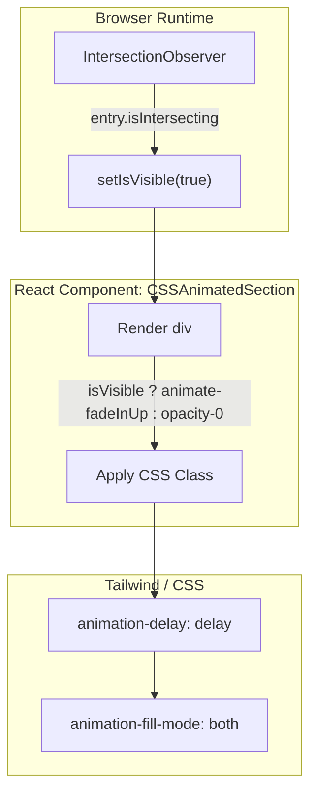
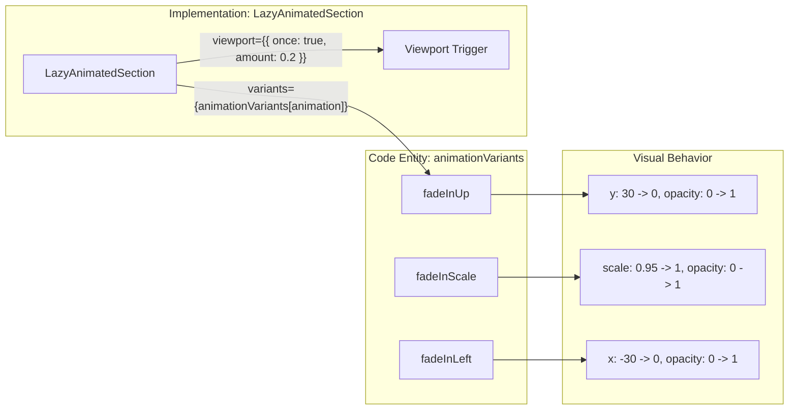

# Tailwind Configuration & Animation

This section documents the styling and animation architecture of the LegalOrbis platform. The project utilizes **Tailwind CSS** for utility-first styling, integrated with **Geist** font variables and a specialized animation pipeline that balances high-performance CSS transitions with complex Framer Motion interactions.

## Tailwind Configuration

The core styling engine is defined in `tailwind.config.ts`, which extends the default Tailwind theme to include the LegalOrbis brand identity and system-level design tokens.

### Brand Palette & System Tokens
The configuration defines a custom `legal` color family and maps system tokens to CSS variables defined in the global stylesheet.

| Token Category | Key | Value / Reference |
|:---|:---|:---|
| **Legal Orbis Brand** | `legal-primary` | `#1a5f5f` (Teal) |
| | `legal-secondary` | `#5eb4d4` (Light Blue) |
| | `legal-accent` | `#2d7a7a` (Medium Teal) |
| | `legal-light` | `#a8d8e6` (Very Light Blue) |
| | `legal-dark` | `#0d3d3d` (Dark Teal) |
| **System Colors** | `primary` | `hsl(var(--primary))` |
| | `background` | `hsl(var(--background))` |
| | `card` | `hsl(var(--card))` |
| **Typography** | `sans` | `var(--font-geist-sans)` |
| | `mono` | `var(--font-geist-mono)` |

**Sources:** [tailwind.config.ts:14-74]()

### Optimization & Keyframes
The configuration includes performance optimizations and custom keyframes for basic UI transitions:
*   **Future Flags**: `hoverOnlyWhenSupported: true` is enabled to prevent hover state "sticking" on touch devices [tailwind.config.ts:11-13]().
*   **Keyframes**: Custom definitions for `fadeIn`, `slideUp`, and `carouselSlide` are provided for standard CSS animations [tailwind.config.ts:80-93]().

## PostCSS & Font Integration

The project uses the `@tailwindcss/postcss` pipeline to process styles. Font integration is handled via CSS variables injected by Next.js font loaders, which are then referenced in the Tailwind theme:

1.  **Geist Sans**: Referenced as `var(--font-geist-sans)` for the primary sans-serif stack [tailwind.config.ts:72]().
2.  **Geist Mono**: Referenced as `var(--font-geist-mono)` for code or technical displays [tailwind.config.ts:73]().

## Animation Architecture

LegalOrbis employs a dual-strategy for animations, choosing between standard CSS transitions and Framer Motion based on the complexity and performance requirements of the component.

### Animation Strategy Comparison

| Feature | `CSSAnimatedSection` | `LazyAnimatedSection` |
|:---|:---|:---|
| **Engine** | Native CSS + Intersection Observer | Framer Motion (`motion.div`) |
| **Performance** | High (GPU accelerated, no JS runtime for animation) | Moderate (Requires Framer Motion runtime) |
| **Control** | Basic (Delay, Duration) | Advanced (Variants, Spring physics, Viewport tracking) |
| **Usage** | High-traffic landing pages | Complex interactive elements |

### CSS-Based Animations
The `CSSAnimatedSection` component uses the native `IntersectionObserver` API to trigger CSS classes when an element enters the viewport.

**Data Flow: CSS Animation Trigger**

**Sources:** [components/ui/css-animated-section.tsx:21-52]()

### Framer Motion Animations
The `LazyAnimatedSection` component provides a more robust set of variants (`fadeInUp`, `fadeInDown`, `fadeInLeft`, `fadeInRight`, `fadeInScale`, `fadeIn`) using the `framer-motion` library. It utilizes the `whileInView` prop to trigger animations once with a specific viewport margin [components/ui/lazy-animated-section.tsx:49-58]().

**Entity Mapping: Animation Variants**

**Sources:** [components/ui/lazy-animated-section.tsx:6-31](), [components/ui/lazy-animated-section.tsx:51-54]()

## Key Implementation Details

### Intersection Observer Configuration
Both components are configured to trigger slightly before the element is fully visible to ensure a smooth transition:
*   **CSSAnimatedSection**: Uses a `threshold` of `0.1` and a `rootMargin` of `-50px` [components/ui/css-animated-section.tsx:30-31]().
*   **LazyAnimatedSection**: Uses an `amount` of `0.2` and a `margin` of `0px 0px -50px 0px` [components/ui/lazy-animated-section.tsx:54]().

### Animation Utility Classes
Standard animations defined in the Tailwind config include:
*   `animate-fade-in`: `fadeIn 0.5s ease-in-out` [tailwind.config.ts:76]().
*   `animate-slide-up`: `slideUp 0.5s ease-out` [tailwind.config.ts:77]().
*   `animate-carousel-slide`: `carouselSlide 0.5s ease-in-out` [tailwind.config.ts:78]().

Sources:
* `tailwind.config.ts`
* `components/ui/css-animated-section.tsx`
* `components/ui/lazy-animated-section.tsx`

---
