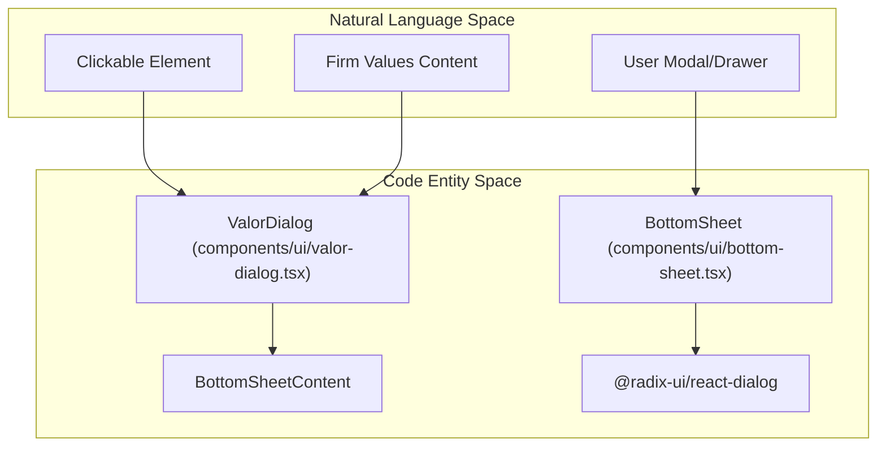
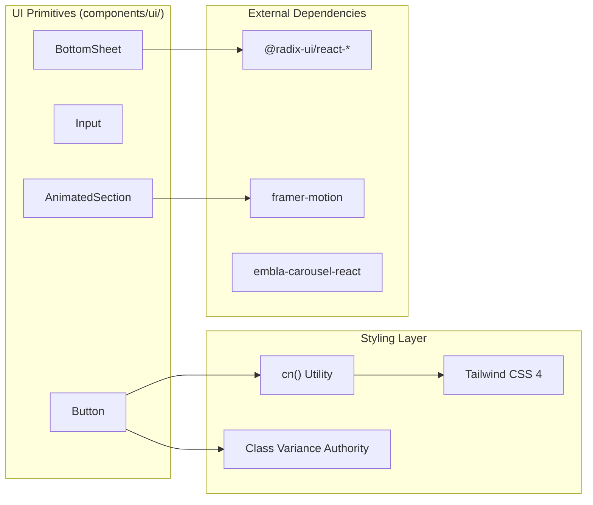

# UI Primitives
The `components/ui/` layer contains the foundational building blocks of the LegalOrbis interface. These components are designed to be highly reusable, following the **Atomic Design** philosophy. The system leverages **Radix UI** for accessible primitives, **Framer Motion** and **Intersection Observer** for animations, and **Tailwind CSS** with the **CVA (Class Variance Authority)** pattern for styling.

## Component Pattern & Utilities

The UI library relies on a centralized utility for class merging and conditional styling.

### `cn()` Utility
Located in `lib/utils.ts`, the `cn()` function combines `clsx` and `tailwind-merge`. This allows for conditional class application while ensuring that Tailwind CSS utility classes are merged correctly without conflicts (e.g., preventing duplicate padding classes) [lib/utils.ts:5-7]().

### CVA (Class Variance Authority)
Components like `Button` (implied by standard Shadcn patterns in this stack) use CVA to define variants (e.g., `primary`, `outline`) and sizes in a type-safe manner.

---

## Animation Primitives

LegalOrbis provides three distinct strategies for scroll-triggered animations to balance performance and complexity.

### AnimatedSection Components Comparison

| Component | Engine | Trigger | Best For |
| :--- | :--- | :--- | :--- |
| `AnimatedSection` | Framer Motion | `whileInView` | Complex sequences, spring physics |
| `LazyAnimatedSection` | Framer Motion | `viewport` | Optimized Framer Motion usage [components/ui/lazy-animated-section.tsx:54-54]() |
| `CSSAnimatedSection` | Vanilla JS + CSS | `IntersectionObserver` | Low-overhead, simple fade/slide effects [components/ui/css-animated-section.tsx:22-33]() |

### Implementation Detail: LazyAnimatedSection
Uses `motion.div` from Framer Motion with predefined variants for `fadeInUp`, `fadeInLeft`, `fadeInScale`, etc. [components/ui/lazy-animated-section.tsx:6-31](). It triggers when 20% of the element is visible with a -50px margin [components/ui/lazy-animated-section.tsx:54-54]().

### Implementation Detail: CSSAnimatedSection
Uses a manual `IntersectionObserver` to toggle a boolean `isVisible` state [components/ui/css-animated-section.tsx:19-25](). Once visible, it applies CSS classes (e.g., `animate-fadeInUp`) defined in the global Tailwind configuration [components/ui/css-animated-section.tsx:45-47]().

**Sources:** [components/ui/lazy-animated-section.tsx:1-60](), [components/ui/css-animated-section.tsx:1-56]()

---

## Overlays & Dialogs

LegalOrbis implements a hybrid overlay system that adapts to the user's device.

### BottomSheet
A polymorphic component built on `@radix-ui/react-dialog`. It provides a standard modal dialog on desktop and a swipeable drawer on mobile [components/ui/bottom-sheet.tsx:100-132]().

**Key Logic:**
- **`useIsMobile`**: Tracks window width to toggle between `fixed center` (Desktop) and `fixed bottom` (Mobile) layouts [components/ui/bottom-sheet.tsx:12-26]().
- **Touch Handling**: Implements `handleTouchStart`, `handleTouchMove`, and `handleTouchEnd` to allow users to swipe the drawer down to close it on mobile devices [components/ui/bottom-sheet.tsx:65-98]().
- **Desktop Close**: A floating close button positioned at the top-right of the viewport for desktop users [components/ui/bottom-sheet.tsx:152-172]().

### ValorDialog
A specialized wrapper for the `BottomSheet` used in the "Quienes Somos" section. It accepts a `valor` object and renders a styled layout containing an image, title, and description [components/ui/valor-dialog.tsx:17-50]().

**Entity Mapping: Overlay System**



**Sources:** [components/ui/bottom-sheet.tsx:1-178](), [components/ui/valor-dialog.tsx:1-51]()

---

## Data-Driven UI Components

### Accordion & Carousel
- **Accordion**: Built using Radix UI primitives. Used primarily in practice area detail pages for FAQs.
- **Carousel**: Built using the `embla-carousel-react` library. It powers the `HeroCarousel` and allows for smooth, touch-enabled sliding with autoplay capabilities.

### Form Inputs
Standardized `Input` and `Textarea` components are used within the `ContactForm`. They are styled with a consistent teal focus ring (`--primary`) and gray borders to match the brand identity.

---

## UI Component Architecture

The following diagram illustrates how the UI primitives interact with the library layer and the styling system.

**Component Data Flow & Styling**



**Sources:** [lib/utils.ts:1-7](), [components/ui/bottom-sheet.tsx:4-6](), [components/ui/lazy-animated-section.tsx:3-3]()

---

## Usage Examples

### Using CSSAnimatedSection
```tsx
// components/ui/css-animated-section.tsx
<CSSAnimatedSection animation="fadeInLeft" delay={0.2}>
  <p>This content slides in from the left using CSS animations.</p>
</CSSAnimatedSection>
```

### Implementing a BottomSheet Trigger
```tsx
// components/ui/bottom-sheet.tsx
<BottomSheet>
  <DialogPrimitive.Trigger>Open Modal</DialogPrimitive.Trigger>
  <BottomSheetContent>
    <h2>Content Title</h2>
    <p>This will be a drawer on mobile and a modal on desktop.</p>
  </BottomSheetContent>
</BottomSheet>
```

**Sources:** [components/ui/css-animated-section.tsx:12-17](), [components/ui/bottom-sheet.tsx:28-32](), [components/ui/bottom-sheet.tsx:51-58]()
