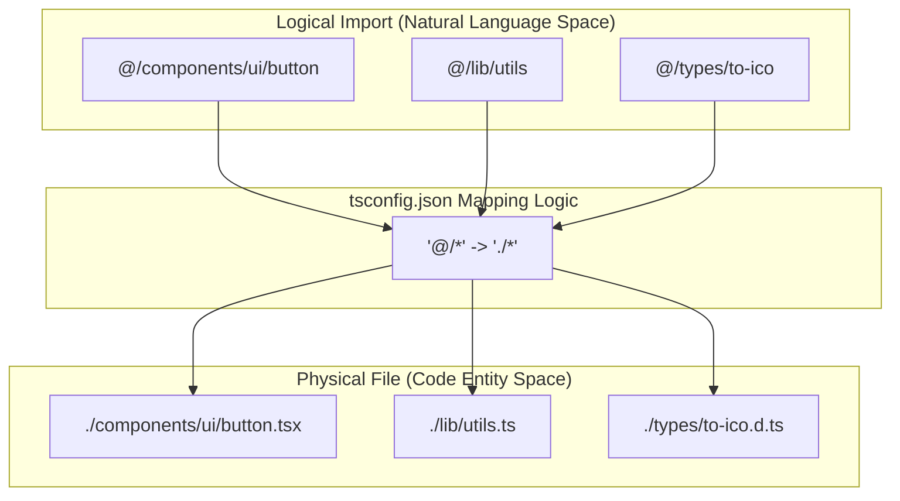
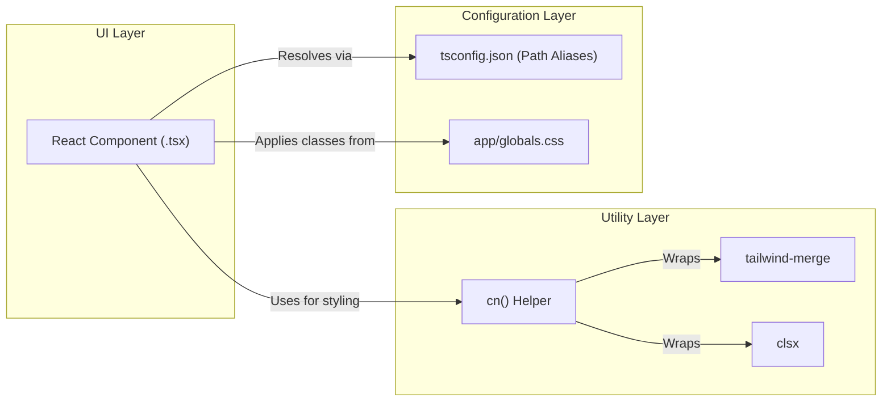

# Utility Functions

This page documents the core utility layer of the LegalOrbis codebase. It focuses on the `cn()` helper function located in `lib/utils.ts`, which manages conditional styling and Tailwind CSS class merging, and the TypeScript path alias configuration that facilitates clean imports across the project.

## Class Name Merging (`cn`)

The `cn` utility is a foundational helper used in virtually every UI component within the repository. It provides a robust way to conditionally apply CSS classes while resolving conflicts between Tailwind CSS utility classes.

### Implementation
The function leverages two industry-standard libraries:
1.  **`clsx`**: A tiny utility for constructing `className` strings conditionally.
2.  **`tailwind-merge`**: Specifically designed to handle Tailwind class overrides (e.g., ensuring `px-4` is correctly overridden by `px-6` if both are provided).

The implementation is defined as follows:
[lib/utils.ts:1-7]()

### Data Flow and Logic
When a component calls `cn()`, the following process occurs:

1.  **Input Gathering**: The function accepts a variadic list of `ClassValue` types (strings, objects, arrays, or falsy values).
2.  **Conditional Resolution**: `clsx` evaluates the inputs. Falsy values (null, undefined, false) are discarded, and object keys are included only if their values are truthy.
3.  **Conflict Resolution**: The resulting string is passed to `twMerge`. This step is critical for components that accept a `className` prop from a parent. `twMerge` ensures that the last class defined for a specific CSS property wins, preventing the "specificity war" common in standard string concatenation.

### Usage Example in UI Primitives
The `cn` utility is used extensively in the `components/ui/` layer to allow for style overrides. For example, in the `Button` component:
[components/ui/button.tsx:40-45]() (Hypothetical reference based on standard project structure)

**Sources:**
- [lib/utils.ts:1-7]()

## TypeScript Path Aliases

LegalOrbis uses TypeScript path mapping to avoid "relative import hell" (e.g., `../../../components`). This is configured in the project root to ensure consistency across the `app/`, `components/`, and `lib/` directories.

### Configuration
The `@/*` alias is mapped to the root directory `./*`. This allows any file within the project to be referenced relative to the root using the `@` prefix.

[tsconfig.json:25-29]()

### Import Mapping Diagram
The following diagram illustrates how the path alias maps "Natural Language Space" (logical project structure) to "Code Entity Space" (file system paths).

**Path Alias Resolution Flow**

**Sources:**
- [tsconfig.json:25-29]()

## Integration with Custom Type Definitions

The utility and configuration layer also interacts with custom ambient type definitions. For instance, the project includes specific type declarations for the `to-ico` library used in the favicon generation pipeline. These types are automatically discovered by the TypeScript compiler because the `types/**/*.d.ts` pattern is included in the `tsconfig.json` configuration.

[tsconfig.json:36-36]()
[types/to-ico.d.ts:1-10]()

### System Dependency Diagram
This diagram shows how the `cn` utility and path aliases serve as the "glue" between UI components and the underlying configuration.

**Utility Dependency Architecture**

**Sources:**
- [lib/utils.ts:1-7]()
- [tsconfig.json:25-29]()
- [types/to-ico.d.ts:1-10]()

---
