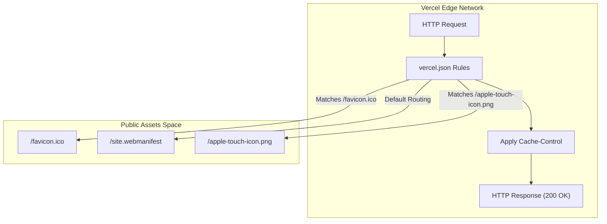
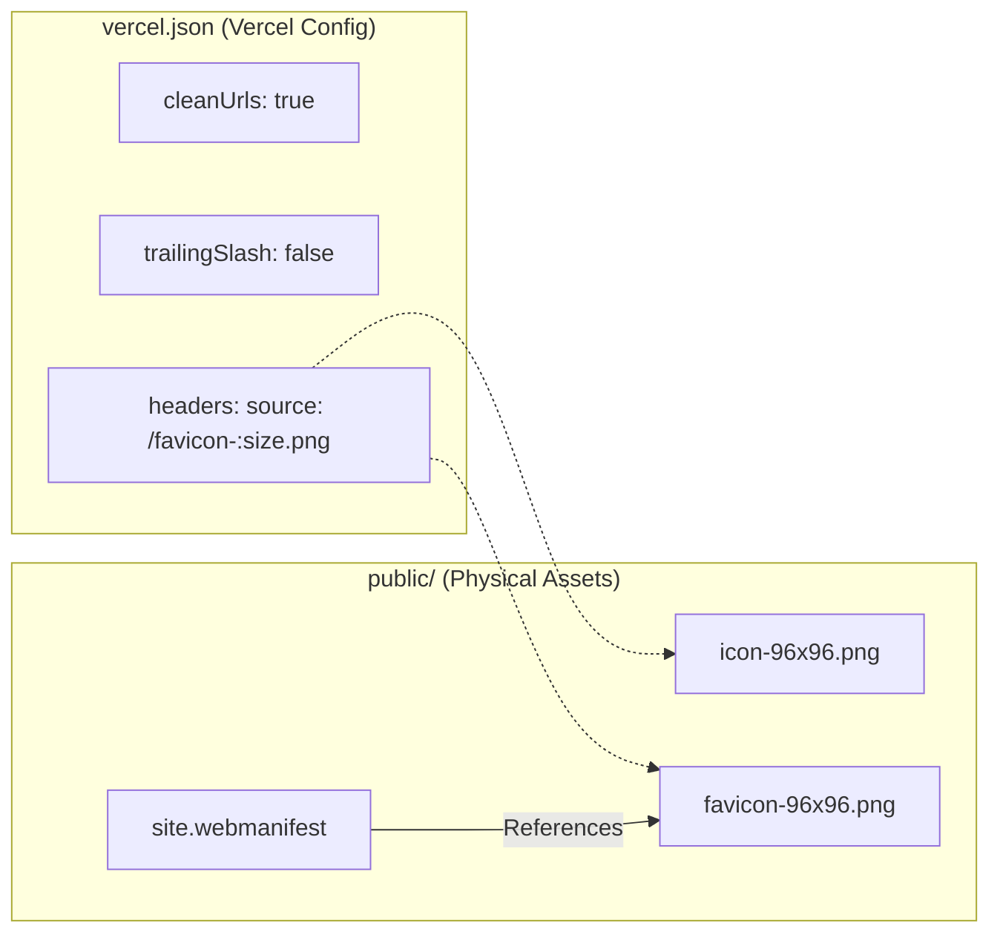

# Vercel Deployment Configuration

This section documents the platform-specific configuration for Vercel, which hosts the LegalOrbis application. It covers the routing behavior, caching strategies for static assets, and the Progressive Web App (PWA) manifest integration.

## Routing and Clean URLs

The application is configured to provide a seamless URL experience by enforcing clean paths and consistent trailing slash behavior.

*   **Clean URLs**: Enabled to allow accessing paths without the `.html` extension [vercel.json:2-2]().
*   **Trailing Slashes**: Disabled (`false`) to ensure that requests to `/areas-juridicas/` are redirected to `/areas-juridicas` for SEO consistency [vercel.json:3-3]().

### Redirects
While the `vercel.json` file contains an empty redirects array [vercel.json:4-4](), specific application redirects (such as the `/areas-juridicas` to `/#areas-juridicas` anchor jump) are typically handled at the Next.js configuration level or via client-side routing logic to ensure users are directed to the correct section of the single-page architecture when they attempt to access the practice areas listing.

## Static Asset Caching

To optimize performance and reduce bandwidth consumption, LegalOrbis implements an aggressive caching strategy for brand assets and favicons. All favicon-related assets are served with an immutable cache header.

### Cache Strategy Implementation
The configuration targets specific file patterns in the `public/` directory and applies a `Cache-Control` header with a TTL of one year (`31536000` seconds) and the `immutable` directive [vercel.json:11-11]().

| Asset Type | Source Pattern | Cache Policy |
| :--- | :--- | :--- |
| Apple Touch Icon | `/apple-touch-icon.png` | `public, max-age=31536000, immutable` |
| Legacy Favicon | `/favicon.ico` | `public, max-age=31536000, immutable` |
| Vector Favicon | `/favicon.svg` | `public, max-age=31536000, immutable` |
| Sized PNGs | `/favicon-:size.png` | `public, max-age=31536000, immutable` |

**Sources:** [vercel.json:5-42]()

## PWA Manifest and Icons

The application includes a Web App Manifest to enable PWA features, allowing users to "install" the site on mobile devices and desktops.

### Web Manifest Configuration
The `site.webmanifest` file defines the application's identity and visual behavior when launched from a home screen.

*   **Identity**: Defined as "Legal Orbis Abogados" with a short name of "Legal Orbis" [public/site.webmanifest:2-3]().
*   **Theme**: The `theme_color` is set to `#1A3635` (matching the brand's primary teal) and the `background_color` is white [public/site.webmanifest:24-25]().
*   **Display**: Set to `standalone` to remove browser UI elements when opened as an app [public/site.webmanifest:26-26]().

### Icon Suite
The manifest references a suite of icons generated to support different device requirements, including maskable icons for Android [public/site.webmanifest:5-23]().

### Deployment Data Flow: Asset Delivery
The following diagram illustrates how Vercel interprets the configuration to serve assets from the `public/` directory with the specified headers.

**Asset Delivery Pipeline**

**Sources:** [vercel.json:1-43](), [public/site.webmanifest:1-29]()

## Technical Entity Mapping

The configuration links platform-level settings to specific files within the repository's `public` directory.

**Configuration to Entity Mapping**

### Manifest Icon Definitions
The manifest explicitly maps sizes to specific file paths to ensure the browser selects the optimal resolution for the user's device.

| Purpose | Source Path | Size | Type |
| :--- | :--- | :--- | :--- |
| Maskable Icon | `/web-app-manifest-192x192.png` | 192x192 | `image/png` |
| Maskable Icon | `/web-app-manifest-512x512.png` | 512x512 | `image/png` |
| Apple Home Screen | `/apple-touch-icon.png` | 180x180 | `image/png` |

**Sources:** [public/site.webmanifest:6-22](), [public/favicon-96x96.png:1-4](), [public/icon-96x96.png:1-4]()

---
